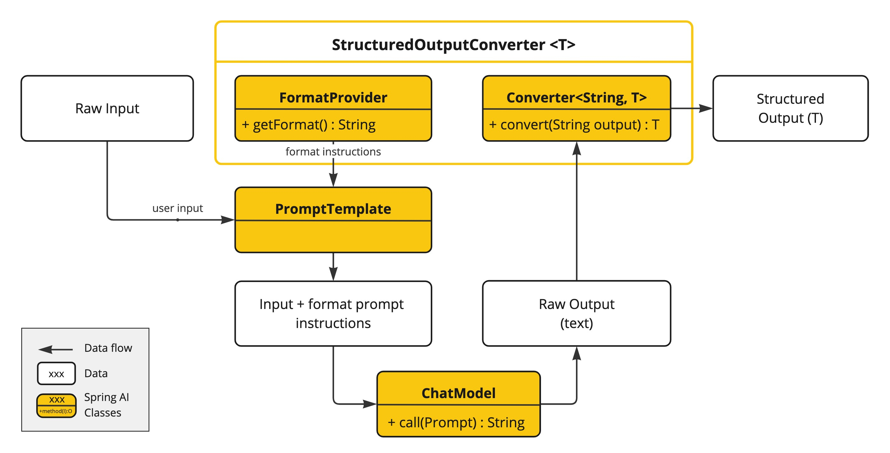
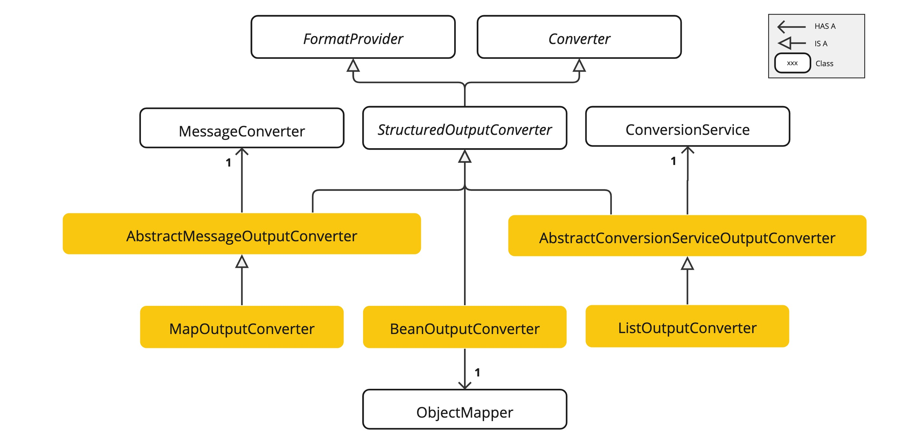
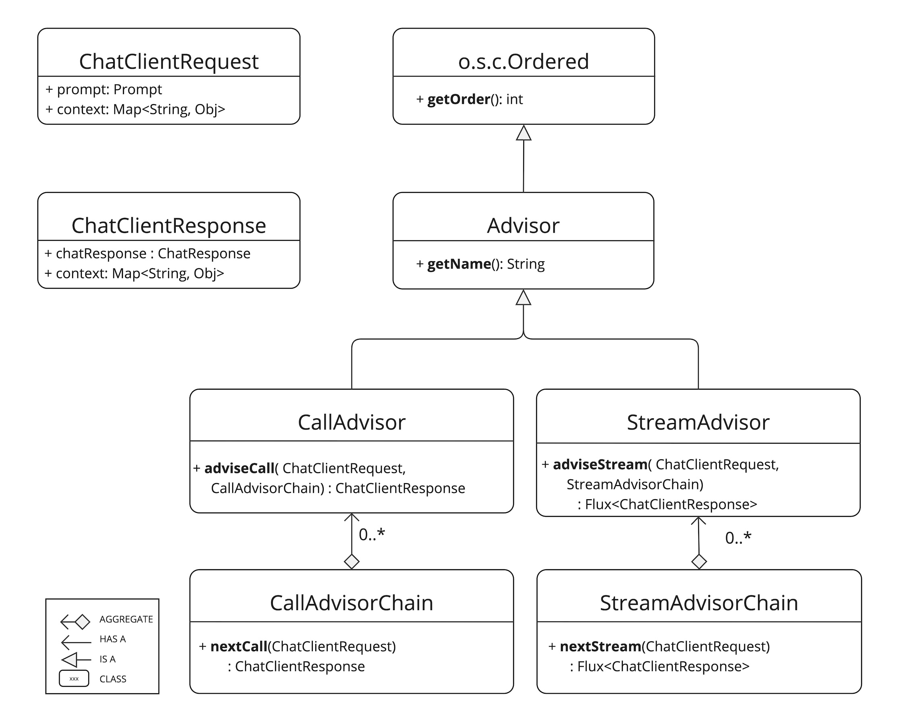
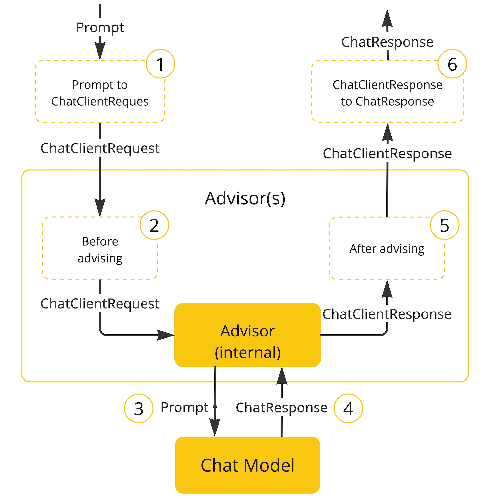
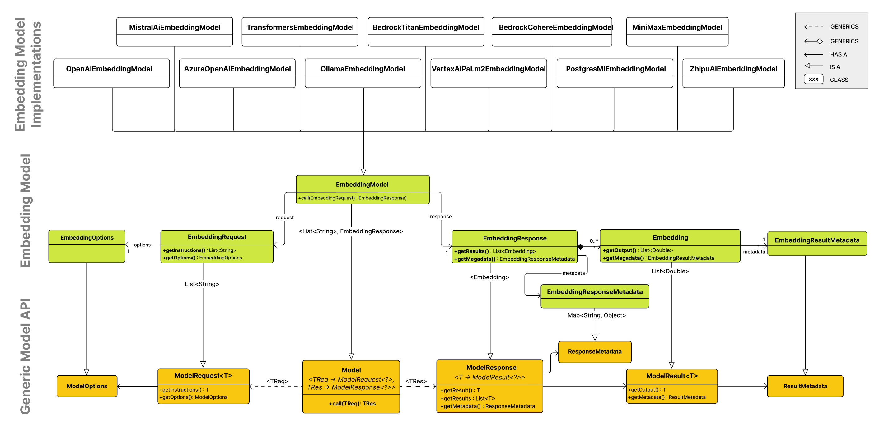
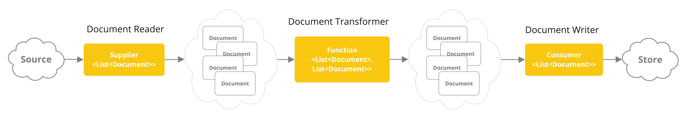
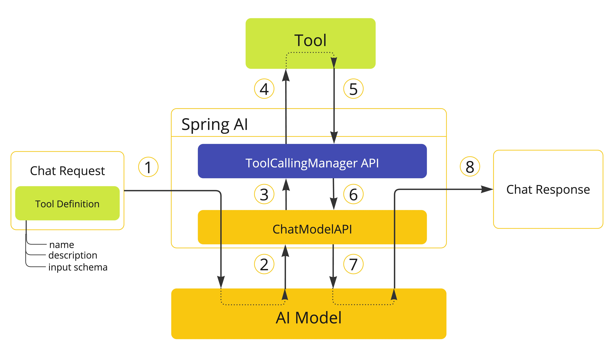

# Spring AI Practice

- [Chat Model API](#chat-model-api)
- [Chat Client API](#chat-client-api)
- [Prompts](#prompts)
- [Structured Output Converter](#structured-output-converter)
- [Audio Models](#audio-models)
- [Image Model API](#image-model-api)
- [Adivisors API](#adivisors-api)
- [Embeddings Model API](#embeddings-model-api)
- [Vector Databases](#vector-databases)
- [Chat Memory](#chat-memory)
- [문서 검색 기반 답변 (Retrieval Augmented Generation, RAG)](#문서-검색-기반-답변-retrieval-augmented-generation-rag)

## Chat Model API

Spring AI는 다양한 Chat Model AI와 연동하여 개발자에게 AI 기반 채팅 완성 기능을 애플리케이션에 통합할 수 있는 기능을 제공합니다. 간편하고 휴대성이 뛰어난 인터페이스로 설계되어 개발자는 최소한의
코드 변경으로 여러 모델 간을 전환할 수 있습니다.

### 기본 Flow

```Mermaid
flowchart LR
    A[Prompt] -- 사용자 입력 --- B[ChatModel]
    A -- 사용자 입력 --- C[StreamingChatModel]
    B -- 모델 응답 --- D[ChatResponse]
    C -- 모델 응답 --- D
```

### Prompt

Spring AI에서 Prompt는 아래와 같이 구성됩니다:

- List<Message> messages: Message 객체의 리스트
- ChatOptions options: 모델에 대한 추가 옵션

#### Message

Message는 Content Interface를 extend하고 MessageType Enum를 추가하여 아래와 같이 구성됩니다:

```java

public interface Content {
    String getText();

    Map<String, Object> getMetadata();
}

public interface Message extends Content {

    MessageType getMessageType();
}
```

Message는 MessageType을 통해 Role을 구분합니다:

```java
public enum MessageType {
    SYSTEM,
    USER,
    ASSISTANT,
    TOOL_RESPONSE
}
```

기본적으로 제공되는 Message 구현체는 다음과 같습니다:

- SystemMessage: 시스템 메시지
- UserMessage: 사용자 메시지
- AssistantMessage: 어시스턴트 메시지
- ToolResponseMessage: 도구 응답 메시지

#### ChatOptions

ChatOptions는 모델에 대한 추가 옵션을 설정하는데 사용됩니다. 예를 들어, 사용 모델, 최대 토큰수, 빈도수 등을 설정할 수 있습니다.

```java
public interface ChatOptions extends ModelOptions {

    String getModel();

    Float getFrequencyPenalty();

    Integer getMaxTokens();

    Float getPresencePenalty();

    List<String> getStopSequences();

    Float getTemperature();

    Integer getTopK();

    Float getTopP();

    ChatOptions copy();

}
```

#### Prompt 예시 (kotlin)

```kotlin
    val systemMessage: SystemMessage = SystemMessage.builder()
    .text("사용자 질문에 대해 한국어로 답변을 해야 합니다.")
    .build()

val userMessage: UserMessage = UserMessage.builder()
    .text(question)
    .build()

val chatOptions: ChatOptions = ChatOptions.builder()
    .model("gpt-4o-mini")
    .temperature(0.3)
    .maxTokens(1000)
    .build()

val prompt: Prompt = Prompt.builder()
    .messages(listOf(systemMessage, userMessage))
    .chatOptions(chatOptions)
    .build()
```

### ChatResponse

ChatResponse는 모델의 응답을 나타내며 아래와 같이 구성됩니다:

- chatResponseMetadata(metadata): 응답 메타데이터
- List<Generation> generations: 모델이 생성한 응답 리스트

```java
public class ChatResponse implements ModelResponse<Generation> {

    private final ChatResponseMetadata chatResponseMetadata;
    private final List<Generation> generations;

    @Override
    public ChatResponseMetadata getMetadata() {...}

    @Override
    public List<Generation> getResults() {...}

    // 기타 메서드...
}
```

### Chat Model Interface

Chat Model Interface는 call 메서드를 통해 Prompt를 입력받아 ChatResponse를 반환합니다. 또한, 편의를 위해 단일 메시지 또는 메시지 배열을 입력받는 오버로드된 call 메서드를
제공합니다.

```java
public interface ChatModel extends Model<Prompt, ChatResponse>, StreamingChatModel {

    default String call(String message) {
        Prompt prompt = new Prompt(new UserMessage(message));
        Generation generation = call(prompt).getResult();
        return (generation != null) ? generation.getOutput().getText() : "";
    }

    default String call(Message... messages) {
        Prompt prompt = new Prompt(Arrays.asList(messages));
        Generation generation = call(prompt).getResult();
        return (generation != null) ? generation.getOutput().getText() : "";
    }

    @Override
    ChatResponse call(Prompt prompt);

    default ChatOptions getDefaultOptions() {
        return ChatOptions.builder().build();
    }

    default Flux<ChatResponse> stream(Prompt prompt) {
        throw new UnsupportedOperationException("streaming is not supported");
    }

}
```

### Chat Model 사용 예시 (kotlin)

```kotlin
    val chatResponse: ChatResponse = chatModel.call(prompt).result.output.text ?: "No response generated."
```

### 마무리

Spring AI의 Chat Model API를 사용하면 다양한 AI 모델과 쉽게 통합하여 강력한 채팅 기능을 쉽게 애플리케이션에 추가할 수 있습니다.

## Chat Client API

ChatClient는 AI Model과 통신하는 fluent API를 제공합니다. 여기서 fluent API란 메서드 체이닝을 통해 직관적이고 가독성 높은 코드를 작성할 수 있는 스타일을 의미합니다.

### Creating a ChatClient

#### ChatClient.Builder

ChatClient는 ChatClient.Builder 객체를 통해 생성할 수 있습니다. Builder는 API 키, 모델, 옵션 등을 설정하는 메서드를 제공합니다. Spring AI는 기본 자동 설정은
`ChatClient.Builder` 빈을 제공합니다.

```Kotlin
@Configuration
class AiConfig {

    @Bean
    fun chatClient(chatClientBuilder: ChatClient.Builder): ChatClient {
        return chatClientBuilder
            .defaultSystem("사용자 질문에 대해 한국어로 답변을 해야 합니다.")
            .defaultOptions(
                ChatOptions.builder()
                    .model("gpt-4o-mini")
                    .temperature(0.3)
                    .maxTokens(1000)
                    .build()
            )
            .build()
    }
}

@Service
class AiService(private val chatClientBuilder: ChatClient.Builder) {

    private val chatClient = chatClientBuilder
        .defaultSystem("사용자 질문에 대해 한국어로 답변을 해야 합니다.")
        .defaultOptions(
            ChatOptions.builder()
                .model("gpt-4o-mini")
                .temperature(0.3)
                .maxTokens(1000)
                .build()
        )
        .build()

    fun askQuestion(question: String): String {
        return chatClient.prompt()
            .user(question)
            .call()
            .content() ?: "No response generated."
    }
}
```

#### Working with Multiple Chat Models

단일 애플리케이션에서 여러 Chat Model을 사용하는 경우도 있습니다. Spring AI에서는 이 문제도 간단하게 해결할 수 있습니다.

> [!Important]
> 먼저 설정을 통해 기본 ChatClient 빈 생성을 비활성화 해야 합니다. 그렇지 않으면 동일한 타입의 빈이 두 개 이상 존재하게 되어 애플리케이션 컨텍스트 로딩에 실패합니다.
>
> ```properties
> spring.ai.chat.client.enabled=false
> ```


여러 ChatClient 빈을 생성하는 예시는 다음과 같습니다:

```Kotlin
// gradle build.gradle.kts
dependencies {
    // ...
    implementation("org.springframework.ai:spring-ai-starter-model-openai")
    implementation("org.springframework.ai:spring-ai-starter-model-anthropic")
    // ...
}

// application.properties
spring.ai.chat.client.enabled = false
spring.ai.model.openai.api - key = your - openai - api - key
spring.ai.model.anthropic.api - key = your - anthropic - api - key

// AiConfig.kt
@Configuration
class AiConfig {
    @Bean
    fun openAi(openAiModel: OpenAiChatModel): ChatClient {
        return ChatClient.create(openAiModel)
    }

    @Bean
    fun authropicChatClient(authropicChatModel: AnthropicChatModel): ChatClient {
        return ChatClient.create(authropicChatModel)
    }
}

// Service.kt
@Service
class AiService(
    @Qualifier("openAi") private val openAiChatClient: ChatClient,
    @Qualifier("authropicChatClient") private val authropicChatClient: ChatClient
) {
    // ...
}
```

### ChatClient Fluent API

ChatClient는 fluent API를 제공하여 직관적이고 가독성 높은 코드를 작성할 수 있습니다. 주로 prompt 빌더를 통해 메시지를 구성합니다.

- `prompt()`: 새로운 프롬프트 빌더를 생성합니다.
- `prompt(prompt: Prompt)`: 기존 프롬프트를 사용합니다.
- `prompt(String content)`: 사용자 메시지로 시작하는 프롬프트를 생성합니다.

### ChatClient Responses

ChatClient는 다양한 응답 형식을 지원합니다:

- ChatResponse: 기본 응답 형식
- Entity: 엔티티 추출 응답 형식
- Streaming Responses: 스트리밍 응답 형식

```kotlin
val chatResponse = chatClient.prompt()
    .user(question)
    .call()
    .chatResponse()

val entity = chatClient.prompt()
    .user(question)
    .call()
    .entity(CustomMessage::class.java)

val streamingResponses = chatClient.prompt()
    .user(question)
    .stream()
    .content()
```

### Prompt Templates

ChatClient Fluent API는 프롬프트 템플릿 기능을 제공합니다.

```kotlin
chatClient.prompt()
    .user { u ->
        u
            .text("{동적변수}를 포함한 질문입니다.")
            .param("동적변수", variableExample)
    }
    .call()
    .content()
```

> [!Note]
> ChatClient에서 직접 구성한 TemplateRenderer는 ChatClient 빌더 체인에 직접 정의한 `prompt` 콘텐츠에만 적용됩니다.
> `QuestionAnswerAdivisor`와 같은 사전 정의된 템플릿에는 적용되지 않습니다.


ChatClient에 다른 템플릿 엔진을 사용하려면 TemplateRenderer 인터페이스의 사용자 지정 구현을 제공할 수 있습니다.

```Kotlin
// 예시: prompt에 JSON을 포함되고 싶고 JSON 구문과 충돌을 피하고 싶다면 다음과 같이 기본 구분 기호 `{}` 대신 `<` 및 `>`를 사용할 수 있습니다.
chatClient.prompt()
    .user { u ->
        u
            .text("<variable>를 포함한 질문입니다.")
            .param("variable", variableExample)
    }
    .templateRenderer(StTemplateRenderer.builder().startDelimiterToken('<').endDelimiterToken('>').build())
    .call()
    .content() ?: NO_RESPONSE
```

### `call()` return values

`call()` 메서드는 다양한 형식의 응답을 반환합니다.

- `String content()`: 응답의 텍스트 콘텐츠를 반환합니다.
- `ChatResponse chatResponse()`: 여러 생성 결과와 메타데이터(토큰 사용량 등)를 포함하는 ChatResponse 객체를 반환합니다.
- `ChatClientResponse chatClientResponse()`: ChatResponse 객체와 ChatClient 실행 컨텍스트를 포함하는 ChatClientResponse 객체를 반환하여
  advisors 실행 중에 사용되는 추가 데이터(예: RAG flow의 문서 등)에 접근할 수 있습니다.
- `ResponseEntity<?> responseEntity()`: HTTP 응답 엔티티를 반환합니다.
- `entity(Class<T> clazz)`: 지정된 클래스 유형의 엔티티를 반환합니다.

### `stream()` return values

`stream()` 메서드는 스트리밍 응답을 반환합니다.

- `Flux<String> content()`: 응답의 텍스트 콘텐츠를 스트리밍합니다.
- `Flux<ChatResponse> chatResponse()`: 추가 메타데이터(토큰 사용량 등)를 포함하는 ChatResponse 객체를 스트리밍합니다.
- `Flux<ChatClientResponse> chatClientResponse()`: `chatClientResponse` 객체를 스트리밍합니다.

### Using defaults

`Configuration` 클래스에서 `ChatClient.Builder` 빈을 구성할 때 기본 시스템 메시지와 옵션을 설정할 수 있습니다.

- `defaultSystem(String systemMessage)`: 모든 프롬프트에 적용할 기본 시스템 메시지를 설정합니다.
- `defaultOptions(ChatOptions options)`: 모든 프롬프트에 적용할 기본 옵션을 설정합니다.
- `defaultFunction(String name, String description, java.util.function.Function<I, O> function)`
    - name: 함수 이름
    - description: 함수 설명
    - function: 함수 구현
- `defaultFunctions(String… functionNames)`: 애플리케이션 컨텍스트에 정의된 `java.util.Function` 빈의 이름을 사용하여 함수를 등록합니다.
- `defaultUser(String text), defaultUser(Resource text), defaultUser(Consumer<UserSpec> userSpecConsumer)`: 사용자 메시지를
  설정합니다.
- `defaultAdvisors(Advisor… advisor)`: 어드바이저를 추가합니다.
- `defaultAdvisors(Consumer<AdvisorSpec> advisorSpecConsumer)`: `AdvisorSpec`을 사용하여 어드바이저를 추가합니다.

```Kotlin
@Configuration
class AiConfig {

    @Bean
    fun chatClient(builder: ChatClient.Builder): ChatClient {
        return builder.defaultSystem("한국어로 대답해줘").build()
    }
}
```

### Advisors

`Advisors API`는 Spring AI에서 가로채고 수정하고 확장할 수 있는 강력한 메커니즘을 제공합니다. RAG(Retrieval-Augmented Generation) 패턴 구현, 로깅, 프롬프트 보강 등
다양한 용도로 사용할 수 있습니다.

사용자 텍스트로 AI 모델을 호출할 때 일반적인 패턴은 프롬포트에 데이터를 추가하거나 보강하는 것입니다. 이러한 데이터는 일반적으로 다음과 같은 형태를 취합니다:

- 단독 데이터: AI 모델이 학습하지 않은 데이터
- 대화 기록: 채팅 모델의 API는 `stateless`이므로 이전 대화 내용이 포함되지 않습니다. 따라서 이전 대화 내용을 프롬프트에 추가할 필요가 있을 수 있습니다.

### 마무리

ChatClient API를 사용하면 Fluent API를 통해 직관적이고 가독성 높은 코드를 작성할 수 있습니다.

## Prompts

Prompts는 AI 모델이 특정 출력을 생성하도록 안내하는 데 사용하는 입력 텍스트입니다. 그래서 효과적인 프롬프트를 작성하는 것은 원하는 결과를 얻는 데 매우 중요합니다. Spring AI는 개발자가 쉽게
프롬프트를 생성하고 관리할 수 있도록 지원합니다.

### Prompt

Spring AI에서 Prompt는 아래와 같이 구성됩니다:

- List<Message> messages: Message 객체의 리스트
- ChatOptions options: 모델에 대한 추가 옵션

```java
public class Prompt implements ModelRequest<List<Message>> {

    private final List<Message> messages;

    private ChatOptions chatOptions;
}
```

### Message

Message는 Prompt의 구성 요소로 Content + Role을 포함합니다.

```java
public interface Content {
    String getText();

    Map<String, Object> getMetadata();
}

public interface Message extends Content {

    MessageType getMessageType();
}
```

Message는 MessageType을 통해 Role을 구분합니다:

```java
public enum MessageType {

    USER("user"),

    ASSISTANT("assistant"),

    SYSTEM("system"),

    TOOL("tool");

    // ...
}
```

### PromptTemplate

Spring AI에서 구조화 된 프롬프트를 생성하기 위해 `PromptTemplate` 인터페이스를 제공합니다.

```java
public class PromptTemplate implements PromptTemplateActions, PromptTemplateMessageActions {

    // ...
}
```

`PromptTemplate`은 `TemplateRenderer`를 사용하여 템플릿을 렌더링합니다. Default로 `StTemplateRenderer`를 사용합니다.

```java
public interface TemplateRenderer extends BiFunction<String, Map<String, Object>, String> {

    @Override
    String apply(String template, Map<String, Object> variables);

}
```

Custom StringTemplate Renderer 예시

```Kotlin
        val template = PromptTemplate.builder()
    .renderer(StTemplateRenderer.builder().startDelimiterToken('<').endDelimiterToken('>').build())
    .template("다음 <text> 문장을 영어로 번역해줘")
    .build()

val prompt = template.render(mapOf("text" to "안녕, 어떻게 지내?"))

assertThat(prompt).isEqualTo("다음 안녕, 어떻게 지내? 문장을 영어로 번역해줘")
```

PromptTemplate 구현하는 interface는 다른 역할을 합니다:

- `PromptTemplateActions`: Prompt 생성에 사용되는 메서드를 제공합니다.

```java
public interface PromptTemplateActions extends PromptTemplateStringActions {

    Prompt create();

    Prompt create(ChatOptions modelOptions);

    Prompt create(Map<String, Object> model);

    Prompt create(Map<String, Object> model, ChatOptions modelOptions);

}
```

- `PromptTemplateStringActions`: 최종 문자열을 렌더링하는 메서드를 제공합니다.

```Java
public interface PromptTemplateStringActions {

    String render();

    String render(Map<String, Object> model);

}
```

- `PromptTemplateMessageActions`: Message 객체를 생성하는 메서드를 제공합니다.

```java
public interface PromptTemplateMessageActions {

    Message createMessage();

    Message createMessage(List<Media> mediaList);

    Message createMessage(Map<String, Object> model);

}
```

### Creating effective prompts

명확하고 효과적인 프롬프트를 보장하기 위해 몇 가지 핵심 구성 요소를 통합하는 것이 중요합니다:

- Instructions: 모델이 수행할 작업에 대한 명확한 지침
- External Context: 필요의 따라 관련 정보나 데이터
- User Input: 유저의 직접적인 요청
- Output Indicator: 모델이 생성해야 하는 출력 유형을 지정하는 지시문

#### Simple Techniques Keywords

- Text Summarization: 텍스트 요약
- Question Answering: 질문 답변
- Text Classification: 텍스트 분류
- Conversation: 대화 생성
- Code Generation: 코드 생성

#### Advanced Techniques Keywords

- Zero-shot Learning: 사전 학습된 지식만을 사용하여 새로운 작업 수행
- Few-shot Learning: 몇 가지 예시를 제공하여 모델이 새로운 작업을 수행하도록 학습
- Chain-of-Thought Prompting: 복잡한 문제 해결을 위해 모델이 단계별로 사고하도록 유도
- Role-playing Prompts: 모델이 특정 역할을 맡아 행동하도록 유도
- Microsoft Guidance: Framework for Prompt Creation and Optimization

### 마무리

효과적인 프롬프트 작성은 원하는 결과를 얻는 데 매우 중요합니다. Spring AI의 Prompt 및 PromptTemplate 기능을 활용하여 명확하고 구조화된 프롬프트를 생성할 수 있습니다.

## Structured Output Converter

일반적으로 AI 모델의 결과를 JSON, XML 또는 Java 클래스와 같은 구조화된 형식으로 변환하는 것이 필요합니다. Spring AI는 이러한 변환을 쉽게 처리할 수 있는 Structured Output
Converter 기능을 제공합니다.

### Structured Output API

`StructuredOutputConverter` 인터페이스는 AI 모델의 출력의 최상위의 인터페이스입니다. 그리고 Spring의 `Converter<String, T>` 인터페이스와 `FormatProvider`
인터페이스를 확장합니다.

```java
public interface StructuredOutputConverter<T> extends Converter<String, T>, FormatProvider {

}
```

다음 다이어그램은 흐름을 보여줍니다:


> 출처: https://docs.spring.io/spring-ai/reference/api/structured-output-converter.html

- FormatProvider: AI 모델에 특정 출력 형식을 지정하는 데 사용됩니다.
- Converter<String, T>: AI 모델의 문자열 출력을 원하는 형식 T로 변환하는 데 사용됩니다.

### Available Converters

Spring AI는 다양한 구조화된 출력 형식을 지원하는 여러 기본 제공 변환기를 제공합니다:


> 출처: https://docs.spring.io/spring-ai/reference/api/structured-output-converter.html

- `AbstractConversionServiceOutputConverter<T>`: 사전 정의된 `GenericConversionService`만 제공합니다.
- `AbstractMessageOutputConverter<T>`: 사전 정의된 `MessageConverter`만 제공합니다.
- `BeanOutputConverter<T>`: 지정한 Java 클래스으로 파생된 `DRAFT_2020_12` JSON 스키마를 생성할 수 있습니다. AI 모델에 이 스키마를 제공하여 구조화된 출력을 생성하도록 할
  수 있습니다. 또 이 컨버터는 AI 모델의 JSON 출력을 지정한 Java 클래스로 변환할 수 있습니다.
- `MapOutputConverter`: RFC82959 호환 JSON 응답을 생성하도록 AI 모델에 지시할 수 있습니다. 또한 AI 모델의 JSON 출력을 `Map<String, Object>`로 변환할 수
  있습니다.
- `ListOutputConverter`: 쉼표로 구분된 목록 출력을 생성하도록 AI 모델에 지시할 수 있습니다. 또한 AI 모델의 쉼표로 구분된 목록 출력을 `java.util.List`로 변환할 수 있습니다.

### Test with Converters

```kotlin
class StructuredOutputConverterTest {

    @Test
    fun beanOutputConverterTest() {
        val converter = BeanOutputConverter(Person::class.java)
        val input = """
            {
              "name": "John Doe",
              "age": 30
            }
        """.trimIndent()

        val person = converter.convert(input) ?: throw IllegalArgumentException("Conversion failed")

        assertThat(person.name).isEqualTo("John Doe")
        assertThat(person.age).isEqualTo(30)

        val format = converter.getFormat()

        println(format)

        val schemaMap = converter.jsonSchemaMap

        println(schemaMap)
    }

    @Test
    fun mapOutputConverterTest() {
        val converter = MapOutputConverter()

        val input = """
            {
              "name": "Jane Doe",
              "age": 25
            }
        """.trimIndent()

        val resultMap = converter.convert(input) ?: throw IllegalArgumentException("Conversion failed")

        println(resultMap)
        assertThat(resultMap["name"]).isEqualTo("Jane Doe")
        assertThat(resultMap["age"]).isEqualTo(25)

        val format = converter.getFormat()
        println(format)
    }

    @Test
    fun listOutputConverterTest() {
        val converter = ListOutputConverter()

        val input = """
            Allice, Albert, Bob, Carol
        """.trimIndent()

        val resultList = converter.convert(input) ?: throw IllegalArgumentException("Conversion failed")

        println(resultList)
        assertThat(resultList).hasSize(4)

        val format = converter.format
        println(format)
    }

    class Person(val name: String, val age: Int)
}
```

### 마무리

Structured Output Converter 기능을 사용하면 AI 모델의 출력을 다양한 구조화된 형식으로 쉽게 변환할 수 있습니다.

## Audio Models

Spring AI는 Transcription 및 Text-to-Speech(TTS) API를 지원합니다.

### Transcription API

Spring AI(1.0.2) 기준 OpenAI Audio Transcription과 Azure OpenAIAudio Transcription를 간편하게 사용할 수 있습니다. OpenAI Audio
Transcription과 Azure OpenAIAudio Transcription은 비슷하기 때문에 OpenAI Audio Transcription 예시를 통해 설명합니다.

#### Spring AI Starter OpenAI Audio Transcription

OpenAI Audio Transcription 지원하는 파일 형식: flac, mp3, mp4, mpeg, mpga, m4a, ogg, wav, or webm.

기본 설정은 `application.properties` 또는 `application.yml`에서 수정할 수 있습니다.

```properties
# 현재 OpenAI에서 whisper-1 모델만 지원, default=whisper-1
spring.ai.openai.audio.transcription.options.model=whisper-1
# json, text, srt, verbose_json, or vtt, default=text
spring.ai.openai.audio.transcription.options.responseFormat=TEXT
# ISO 639-1 언어 코드, null이면 자동 감지, default=null
spring.ai.openai.audio.transcription.options.language=null
# 0.0 ~ 1.0 사이의 값, default=0.7
spring.ai.openai.audio.transcription.options.temperature=0.7
# word 또는 sentence, null이면 자동 설정, default=null
spring.ai.openai.audio.transcription.options.granularity-type=null
# OpenAI API 기본 URL, default=api.openai.com
spring.ai.openai.audio.transcription.base-url=api.openai.com
```

개별 설정을 하려면 `OpenAiAudioTranscriptionOptions`를 사용하여 `Prompt`에 전달할 수 있습니다.

```kotlin
val audioOptions = OpenAiAudioTranscriptionOptions.builder()
    .model("whisper-1")
    .responseFormat(OpenAiAudioApi.TranscriptResponseFormat.VERBOSE_JSON)
    .temperature(0.7f)
    .language("ko")
    .build()

val transcriptionPrompt = AudioTranscriptionPrompt(audioInput, audioOptions)
```

> 참조: OpenAI Audio Transcription API
> https://platform.openai.com/docs/api-reference/audio/createTranscription

OpenAI Audio Transcription 사용 예시

```kotlin
fun transcribeAudio(audioFile: MultipartFile): String {
    val audioInput = audioFile.resource

    val transcriptionPrompt = AudioTranscriptionPrompt(audioInput)

    val response = transcriptionModel.call(transcriptionPrompt)
    return response.result.output
}
```

### Text-to-Speech (TTS) API

기본 설정은 application.properties 또는 application.yml에서 수정할 수 있습니다.

```Properties

spring.ai.model.audio.speech=openai
spring.ai.openai.audio.speech.base-url=api.openai.com
# tts-1, tts-1-hd; default=tts-1
spring.ai.openai.audio.speech.options.model=tts-1
# alloy, echo, fable, onyx, nova, and shimmer; default=alloy
spring.ai.openai.audio.speech.options.voice=alloy
# mp3, opus, aac, flac, wav, and pcm; default=mp3
spring.ai.openai.audio.speech.options.response-format=mp3
# 0.25 (slowest) to 4.0 (fastest); default=1.0
spring.ai.openai.audio.speech.options.speed=1.0
```

개별 설정을 하려면 `OpenAiAudioSpeechOptions`를 사용하여 `Prompt`에 전달할 수 있습니다.

```kotlin
val speedOptions = OpenAiAudioSpeechOptions.builder()
    .model("tts-1")
    .voice(OpenAiAudioApi.SpeechRequest.Voice.ALLOY)
    .responseFormat(OpenAiAudioApi.SpeechRequest.AudioResponseFormat.MP3)
    .speed(1.0f)
    .build()

val speechPrompt = SpeechPrompt(text, speedOptions)
```

> 참조: OpenAI Create Speech API
> https://platform.openai.com/docs/api-reference/audio/createSpeech

OpenAI Text-to-Speech 사용 예시

```kotlin
fun textToSpeech(text: String): Resource {
    val speechPrompt = SpeechPrompt(text)

    val response = speechModel.call(speechPrompt)
    return ByteArrayResource(response.result.output)
}
```

Streaming TTS 사용 예시

```kotlin
fun streamTextToSpeech(text: String): Flux<ByteArray> {
    val speechPrompt = SpeechPrompt(text)

    return speechModel.stream(speechPrompt)
        .map { it.result.output }
}
```

### 마무리

Spring AI의 Audio Models 기능은 아직 그렇게 드라마 틱하지는 않는 것 같고 주로 OpenAI 만 지원해서 기능이 제한적인것 같습니다. ChatClient API와 같이 상위 Interface를
제공하지도 않아 Spring 스럽지 않은 느낌이 듭니다. 이후 버전에서 개선되길 기대합니다.

## Image Model API

Spring AI는 Image Model API를 통해 다양한 AI 기반 이미지 생성 모델과 통합할 수 있는 기능을 제공합니다.

### Image Model Interface

Image Model Interface는 call 메서드를 통해 ImagePrompt를 입력받아 ImageResponse를 반환합니다. Model 인터페이스를 확장하여 일관된 구조를 유지합니다.

```java

@FunctionalInterface
public interface ImageModel extends Model<ImagePrompt, ImageResponse> {

    ImageResponse call(ImagePrompt request);

}
```

### ImagePrompt

ImagePrompt는 ModelRequest 인터페이스를 구현하며, 이미지 생성에 필요한 메시지와 옵션을 포함합니다.

```Java
public class ImagePrompt implements ModelRequest<List<ImageMessage>> {

    private final List<ImageMessage> messages;

    private ImageOptions imageModelOptions;

    @Override
    public List<ImageMessage> getInstructions() {...}

    @Override
    public ImageOptions getOptions() {...}

    // constructors and utility methods omitted
}
```

### ImageMessage

ImageMessage는 이미지 생성에 필요한 텍스트와 가중치를 포함합니다.

```Java
public class ImageMessage {

    private String text;

    private Float weight;

    public String getText() {...}

    public Float getWeight() {...}

    // constructors and utility methods omitted
}
```

### ImageOptions

ImageOptions는 ModelOptions 인터페이스를 확장하며, 이미지 생성에 필요한 다양한 옵션을 제공합니다.

```Java
public interface ImageOptions extends ModelOptions {

    Integer getN();

    String getModel();

    Integer getWidth();

    Integer getHeight();

    String getResponseFormat(); // openai - url or base64 : stability ai byte[] or base64

}
```

### ImageResponse

ImageResponse는 ModelResponse 인터페이스를 구현하며, 이미지 생성 결과와 메타데이터를 포함합니다.

```Java
public class ImageResponse implements ModelResponse<ImageGeneration> {

    private final ImageResponseMetadata imageResponseMetadata;

    private final List<ImageGeneration> imageGenerations;

    @Override
    public ImageGeneration getResult() {
        // get the first result
    }

    @Override
    public List<ImageGeneration> getResults() {...}

    @Override
    public ImageResponseMetadata getMetadata() {...}

    // other methods omitted

}
```

### ImageGeneration

ImageGeneration는 ModelResult 인터페이스를 구현하며, 개별 이미지 생성 결과와 메타데이터를 포함합니다.

```Java
public class ImageGeneration implements ModelResult<Image> {

    private ImageGenerationMetadata imageGenerationMetadata;

    private Image image;

    @Override
    public Image getOutput() {...}

    @Override
    public ImageGenerationMetadata getMetadata() {...}

    // other methods omitted

}
```

### Available Image Models

Spring AI（1.0.2）기준 공식적으로 지원하는 모델은 아래와 같습니다:

- OpenAI Image Generation
- Azure OpenAI Image Generation
- QianFan Image Generation
- Stability AI Image Generation
- ZhiPuAI Image Generation

### OpenAI Image Model Analysis Example

OpenAI 이미지 분석은 OpenAI Chat Model API의 멀티모달 기능을 활용하여 이미지와 텍스트를 함께 처리할 수 있습니다. Spring AI에서는 OpenAI Chat Model 혹은
ChatClient API를 사용하여 이미지 분석을 수행할 수 있습니다.

```kotlin
fun analyzeImage(image: MultipartFile, question: String): String {

    val resource = InputStreamResource(image.inputStream)
    val mimeType = MimeType.valueOf(image.contentType ?: MediaType.IMAGE_JPEG_VALUE)

    return openAiGPT4OMini.prompt()
        .user { userSpec ->
            userSpec
                .text(question)
                .media(mimeType, resource)
        }
        .call()
        .content() ?: "No response generated."
}

fun analyzeImageUrl(imageUrl: String, question: String): String {

    val systemMessage = SystemMessage("한국어로 대답해줘")
    val url = URI(imageUrl)

    val userMessage = UserMessage.builder()
        .text(question)
        .media(Media(MimeTypeUtils.IMAGE_PNG, url))
        .build()

    val prompt = Prompt(systemMessage, userMessage)

    return openAiModel.call(prompt).result.output.text ?: "No response generated."
}
```

### OpenAI Image Generation Example

```kotlin
fun generateImage(question: String): Image {
    val prompt = ImagePrompt(
        question,
        OpenAiImageOptions.builder()
            .height(1024)
            .width(1024)
            .build()
    )

    val result = imageModel.call(prompt).result

    return result.output
}
```

### 마무리

Spring AI에서 공식적으로 지원하는 기능은 Image Genration과 멀티모달 기능을 활용한 이미지 분석입니다. 이미지 편집, 변환 등은 아직 지원하지 않는 것 같습니다. 이후 버전에서 개선되길 기대합니다.

## Adivisors API

Spring AI Advisors API는 Spring AI에서 가로채고 수정하고 확장할 수 있는 강력한 메커니즘을 제공합니다.

### Core Components


> 출처: https://docs.spring.io/spring-ai/reference/api/advisors.html#_core_components

- advisorCall(), advisorStream(): Advisor의 핵심 메서드로 플롬프트를 보내기전에 검사, 정의, 확장하고 응답을 받은 후 응답 검사, 처리 오류 처리 등을 수행합니다.
- getOrder(): Advisor의 실행 순서를 정의합니다. 낮은 값이 먼저 실행됩니다.
- getName(): Advisor의 이름을 반환합니다.

### Advisors Flow


> 출처: https://docs.spring.io/spring-ai/reference/api/advisors.html#_core_components

### Default Advisors

Spring AI는 몇 가지 기본 Advisors를 제공합니다:

- SimpleLoggerAdvisor: 요청 및 응답을 로깅합니다.

    ```Java
    
    @Override
    public ChatClientResponse adviseCall(ChatClientRequest chatClientRequest, CallAdvisorChain callAdvisorChain) {
        // 1. 요청 로깅
        // AI 모델 호출 전, 사용자 요청 내용을 로그에 기록
        // (디버깅, 모니터링, 감사 목적)
        logRequest(chatClientRequest);
    
        // 2. 다음 Advisor 또는 실제 AI 모델 호출
        // Chain of Responsibility 패턴: 다음 체인으로 요청 전달
        // 여러 Advisor가 있다면 순차적으로 실행되고, 마지막에는 실제 AI 모델이 호출됨
        ChatClientResponse chatClientResponse = callAdvisorChain.nextCall(chatClientRequest);
    
        // 3. 응답 로깅
        // AI 모델 호출 후, 생성된 응답 내용을 로그에 기록
        // (성능 측정, 응답 품질 분석, 문제 추적 목적)
        logResponse(chatClientResponse);
    
        // 4. 응답 반환
        // 로깅 완료 후 원본 응답을 그대로 반환 (응답 수정 없음)
        return chatClientResponse;
    }
    ```

- VectorStoreChatMemoryAdvisor: 벡터 DB에 대화를 저장하고 의미 유사도 검색으로 관련 과거 대화만 선택적으로 가져와 프롬프트에 추가합니다.
    - before(): 프롬프트를 보내기 전에 벡터 저장소에서 관련 문서를 검색하고 시스템 메시지에 추가합니다.
    - after(): 모델의 응답을 받은 후, 새로운 사용자 메시지를 벡터 저장소에 저장합니다.

        ```Java
        @Override
        public ChatClientRequest before(ChatClientRequest request, AdvisorChain advisorChain) {
            // 1. 대화 컨텍스트 정보 추출
            // 현재 대화 세션의 고유 ID 획득 (없으면 기본값 사용)
            String conversationId = getConversationId(request.context(), this.defaultConversationId);
        
            // 사용자 메시지 텍스트 추출 (null인 경우 빈 문자열 사용)
            String query = request.prompt().getUserMessage() != null ?
                    request.prompt().getUserMessage().getText() : "";
        
            // 검색할 메모리 개수(topK) 결정 (컨텍스트에서 가져오거나 기본값 사용)
            int topK = getChatMemoryTopK(request.context());
        
            // 2. 벡터 저장소에서 관련 대화 검색
            // 같은 대화 세션의 메모리만 검색하도록 필터 설정
            String filter = DOCUMENT_METADATA_CONVERSATION_ID + "=='" + conversationId + "'";
        
            // 검색 요청 객체 생성: 사용자 질문과 의미적으로 유사한 과거 대화 검색
            var searchRequest = org.springframework.ai.vectorstore.SearchRequest.builder()
                    .query(query)              // 검색 쿼리 (현재 사용자 메시지)
                    .topK(topK)                // 상위 K개 결과만 반환
                    .filterExpression(filter)  // 대화 ID 필터 적용
                    .build();
        
            // 벡터 유사도 검색 실행 - 관련성 높은 과거 대화 가져오기
            java.util.List<org.springframework.ai.document.Document> documents = this.vectorStore
                    .similaritySearch(searchRequest);
        
            // 3. Long-term Memory 문자열 생성
            // 검색된 과거 대화들을 하나의 문자열로 결합 (각 대화는 줄바꿈으로 구분)
            String longTermMemory = documents == null ? ""
                    : documents.stream()
                    .map(org.springframework.ai.document.Document::getText)  // 각 문서의 텍스트 추출
                    .collect(java.util.stream.Collectors.joining(System.lineSeparator()));  // 줄바꿈으로 연결
        
            // 4. 시스템 프롬프트에 메모리 추가 (RAG 패턴의 "증강" 단계)
            // 기존 시스템 메시지 가져오기
            org.springframework.ai.chat.messages.SystemMessage systemMessage = request.prompt().getSystemMessage();
        
            // 템플릿을 사용해 시스템 메시지와 long-term memory를 결합
            // 예: "지시사항: {instructions}\n과거 대화: {long_term_memory}"
            String augmentedSystemText = this.systemPromptTemplate
                    .render(java.util.Map.of("instructions", systemMessage.getText(),
                            "long_term_memory", longTermMemory));
        
            // 5. 증강된 시스템 메시지로 새로운 요청 객체 생성
            // mutate()를 사용해 기존 요청을 복사하고 프롬프트만 수정
            ChatClientRequest processedChatClientRequest = request.mutate()
                    .prompt(request.prompt().augmentSystemMessage(augmentedSystemText))
                    .build();
        
            // 6. 현재 사용자 메시지를 벡터 저장소에 저장 (향후 검색을 위해)
            org.springframework.ai.chat.messages.UserMessage userMessage = processedChatClientRequest.prompt()
                    .getUserMessage();
        
            if (userMessage != null) {
                // 사용자 메시지를 Document로 변환하여 벡터 DB에 저장
                // 나중에 이 대화를 검색할 수 있도록 인덱싱
                this.vectorStore.write(toDocuments(java.util.List.of(userMessage), conversationId));
            }
        
            // 7. 메모리가 증강된 요청 객체 반환
            // 이제 AI는 과거 대화 컨텍스트를 포함한 프롬프트로 응답을 생성함
            return processedChatClientRequest;
        }

        @Override
        public ChatClientResponse after(ChatClientResponse chatClientResponse, AdvisorChain advisorChain) {
            // 1. AI 어시스턴트 응답 메시지 추출
            // 빈 리스트로 초기화 (응답이 없는 경우 대비)
            List<Message> assistantMessages = new ArrayList<>();
        
            // chatResponse가 null이 아닌 경우에만 처리 (null 안전성 체크)
            if (chatClientResponse.chatResponse() != null) {
                // 2. 응답 결과에서 모든 어시스턴트 메시지 추출
                assistantMessages = chatClientResponse.chatResponse()
                        .getResults()                           // 모든 생성 결과 가져오기 (스트리밍의 경우 여러 개일 수 있음)
                        .stream()                               // 스트림으로 변환
                        .map(g -> (Message) g.getOutput())      // 각 결과에서 실제 메시지 객체 추출
                        .toList();                              // List로 수집
            }
        
            // 3. AI 응답을 벡터 저장소에 저장 (Long-term Memory 구축)
            // 현재 대화의 conversationId와 함께 저장하여 나중에 검색 가능하도록 함
            this.vectorStore.write(
                    toDocuments(assistantMessages,  // 메시지들을 Document 형식으로 변환
                            this.getConversationId(chatClientResponse.context(), this.defaultConversationId))  // 대화 ID 추출
            );
        
            // 4. 원본 응답 객체를 그대로 반환
            // after() 메서드는 응답을 수정하지 않고, 저장만 수행함
            return chatClientResponse;
        }
        ```

- PromptChatMemoryAdvisor: 이는 VectorStoreChatMemoryAdvisor와 유사하지만, 벡터 저장소 대신 메모리 내에서 대화 기록을 관리합니다.
    - before(): 프롬프트를 보내기 전에 메모리에서 관련 대화를 검색하고 시스템 메시지에 추가합니다.
    - after(): 모델의 응답을 받은 후, 새로운 사용자 메시지를 메모리에 저장합니다.

        ```java
        @Override
        public ChatClientRequest before(ChatClientRequest chatClientRequest, AdvisorChain advisorChain) {
            // 현재 대화 세션의 고유 ID 획득 (없으면 기본값 사용)
            String conversationId = getConversationId(chatClientRequest.context(), this.defaultConversationId);
                  
            // 1. 현재 대화의 메모리(대화 히스토리) 조회
            // ChatMemory에서 이 대화 세션의 모든 과거 메시지 가져오기
            List<Message> memoryMessages = this.chatMemory.get(conversationId);
                  
            // 디버그 로그: 메모리 처리 전 상태 기록
            logger.debug("[PromptChatMemoryAdvisor.before] Memory before processing for conversationId={}: {}",
                  conversationId, memoryMessages);
              
            // 2. 메모리 메시지를 문자열 형식으로 변환
            // USER와 ASSISTANT 메시지만 필터링하여 "역할:내용" 형식으로 변환
            String memory = memoryMessages.stream()
               .filter(m -> m.getMessageType() == MessageType.USER || 
                            m.getMessageType() == MessageType.ASSISTANT)  // 시스템 메시지 등 제외
               .map(m -> m.getMessageType() + ":" + m.getText())          // "USER:안녕하세요" 형식으로 변환
               .collect(Collectors.joining(System.lineSeparator()));      // 각 메시지를 줄바꿈으로 구분
              
            // 3. 시스템 메시지에 대화 메모리 추가 (컨텍스트 증강)
            // 기존 시스템 메시지 가져오기
            SystemMessage systemMessage = chatClientRequest.prompt().getSystemMessage();
                  
            // 템플릿을 사용해 시스템 지시사항과 대화 히스토리 결합
            // 예: "지시사항: {instructions}\n대화 기록: {memory}"
            String augmentedSystemText = this.systemPromptTemplate
               .render(Map.of("instructions", systemMessage.getText(), 
                              "memory", memory));
              
            // 4. 증강된 시스템 메시지로 새로운 요청 객체 생성
            // mutate()를 사용해 기존 요청을 복사하고 프롬프트만 수정
            ChatClientRequest processedChatClientRequest = chatClientRequest.mutate()
               .prompt(chatClientRequest.prompt().augmentSystemMessage(augmentedSystemText))
               .build();
              
            // 5. 현재 사용자 메시지를 대화 메모리에 추가
            // (시스템 메시지 생성 후에 추가 - 현재 메시지는 다음 요청에서 사용됨)
            UserMessage userMessage = processedChatClientRequest.prompt().getUserMessage();
                  
            // ChatMemory에 현재 사용자 메시지 저장 (다음 대화에서 컨텍스트로 활용)
            this.chatMemory.add(conversationId, userMessage);
              
            // 6. 메모리가 증강된 요청 객체 반환
            // AI는 이제 전체 대화 히스토리를 포함한 컨텍스트로 응답 생성
            return processedChatClientRequest;
        }

      @Override
      public ChatClientResponse after(ChatClientResponse chatClientResponse, AdvisorChain advisorChain) {
          // 1. AI 어시스턴트 응답 메시지를 담을 리스트 초기화
          List<Message> assistantMessages = new ArrayList<>();
          
          // 2. 스트리밍 응답 처리 (단일 결과가 있는 경우)
          // 스트리밍 모드에서는 하나의 결과만 반환되므로 별도 처리
          if (chatClientResponse.chatResponse() != null && 
              chatClientResponse.chatResponse().getResult() != null &&
              chatClientResponse.chatResponse().getResult().getOutput() != null) {
             // 단일 결과를 리스트로 래핑
             assistantMessages = List.of((Message) chatClientResponse.chatResponse().getResult().getOutput());
          }
          // 3. 일반(비스트리밍) 응답 처리 (여러 결과가 있을 수 있는 경우)
          else if (chatClientResponse.chatResponse() != null) {
             // 모든 생성 결과에서 어시스턴트 메시지 추출
             assistantMessages = chatClientResponse.chatResponse()
                .getResults()                           // 모든 결과 가져오기
                .stream()                               // 스트림 변환
                .map(g -> (Message) g.getOutput())      // 각 결과에서 메시지 추출
                .toList();                              // List로 수집
          }
      
          // 4. 추출된 어시스턴트 메시지가 있으면 메모리에 추가
          if (!assistantMessages.isEmpty()) {
             // 현재 대화 세션의 메모리에 AI 응답 저장
             this.chatMemory.add(
                   this.getConversationId(chatClientResponse.context(), this.defaultConversationId),
                   assistantMessages
             );
      
             // 5. 디버그 로깅 (디버그 레벨이 활성화된 경우에만)
             if (logger.isDebugEnabled()) {
                // 메모리에 추가된 ASSISTANT 메시지 로그
                logger.debug(
                      "[PromptChatMemoryAdvisor.after] Added ASSISTANT messages to memory for conversationId={}: {}",
                      this.getConversationId(chatClientResponse.context(), this.defaultConversationId),
                      assistantMessages
                );
                
                // 메모리에 추가 후 전체 대화 히스토리 조회
                List<Message> memoryMessages = this.chatMemory
                   .get(this.getConversationId(chatClientResponse.context(), this.defaultConversationId));
                
                // 현재 메모리 상태 전체 로그 (누적된 모든 대화)
                logger.debug(
                      "[PromptChatMemoryAdvisor.after] Memory after ASSISTANT add for conversationId={}: {}",
                      this.getConversationId(chatClientResponse.context(), this.defaultConversationId),
                      memoryMessages
                );
             }
          }
          
          // 6. 원본 응답 객체를 그대로 반환
          // after() 메서드는 응답을 수정하지 않고, 메모리 저장과 로깅만 수행
          return chatClientResponse;
      }
      ```   

- MessageChatMemoryAdvisor: 과거 대화를 Message 객체 배열 형태로 유지하며 현재 요청의 메시지 리스트에 직접 병합하여 전체 대화 히스토리를 AI에게 전달합니다.
    - Before: 과거 대화를 메모리에서 조회하여 현재 요청의 메시지 리스트에 추가합니다.
    - After: 모델의 응답을 받은 후, 새로운 어시스턴트 메시지를 메모리에 저장합니다.

        ```Java
        @Override
        public ChatClientRequest before(ChatClientRequest chatClientRequest, AdvisorChain advisorChain) {
            // 현재 대화 세션의 고유 ID 획득 (없으면 기본값 사용)
            String conversationId = getConversationId(chatClientRequest.context(), this.defaultConversationId);
      
            // 1. 현재 대화의 메모리(대화 히스토리) 조회
            // ChatMemory에서 이 대화 세션의 모든 과거 메시지 가져오기
            // (USER, ASSISTANT, SYSTEM 등 모든 타입의 메시지 포함)
            List<Message> memoryMessages = this.chatMemory.get(conversationId);
      
            // 2. 메시지 리스트 재구성 (메모리 + 현재 요청)
            // 과거 대화 히스토리를 포함하는 새로운 메시지 리스트 생성
            List<Message> processedMessages = new ArrayList<>(memoryMessages);  // 기존 메모리 복사
          
            // 현재 요청의 지시사항(instructions) 메시지들을 추가
            // instructions에는 SystemMessage, UserMessage 등이 포함될 수 있음
            processedMessages.addAll(chatClientRequest.prompt().getInstructions());
      
            // 3. 재구성된 메시지 리스트로 새로운 요청 객체 생성
            // mutate()를 중첩 사용하여 요청과 프롬프트를 모두 수정
            ChatClientRequest processedChatClientRequest = chatClientRequest.mutate()
               .prompt(
                  chatClientRequest.prompt()
                     .mutate()
                     .messages(processedMessages)  // 과거 대화 + 현재 요청으로 메시지 교체
                     .build()
               )
               .build();
      
            // 4. 현재 사용자 메시지를 대화 메모리에 추가
            // 다음 대화 턴에서 컨텍스트로 활용하기 위해 저장
            UserMessage userMessage = processedChatClientRequest.prompt().getUserMessage();
            this.chatMemory.add(conversationId, userMessage);
      
            // 5. 메모리가 포함된 요청 객체 반환
            // AI는 이제 전체 대화 히스토리가 포함된 메시지 리스트로 응답 생성
            return processedChatClientRequest;
        }

        @Override
        public ChatClientResponse after(ChatClientResponse chatClientResponse, AdvisorChain advisorChain) {
            // 1. AI 어시스턴트 응답 메시지를 담을 리스트 초기화
            List<Message> assistantMessages = new ArrayList<>();
      
            // 2. 응답에서 모든 어시스턴트 메시지 추출 (null 안전성 체크)
            if (chatClientResponse.chatResponse() != null) {
                // 모든 생성 결과에서 어시스턴트 메시지 추출
                assistantMessages = chatClientResponse.chatResponse()
                        .getResults()                           // 모든 결과 가져오기 (여러 개일 수 있음)
                        .stream()                               // 스트림으로 변환
                        .map(g -> (Message) g.getOutput())      // 각 결과에서 실제 메시지 객체 추출
                        .toList();                              // List로 수집
            }
      
            // 3. AI 응답을 대화 메모리에 추가
            // 현재 대화 세션(conversationId)의 메모리에 어시스턴트 메시지 저장
            // 다음 대화 턴에서 컨텍스트로 활용하기 위함
            this.chatMemory.add(
                    this.getConversationId(chatClientResponse.context(), this.defaultConversationId),
                    assistantMessages
            );
      
            // 4. 원본 응답 객체를 그대로 반환
            // after() 메서드는 응답을 수정하지 않고, 메모리 저장만 수행 (Pass-through)
            return chatClientResponse;
        }
        ```

- ChatModelCallAdvisor: 응답 형식 지시사항(JSON, XML 등)을 프롬프트에 추가하고 Advisor 체인을 우회하여 ChatModel을 직접 호출합니다.

    ```Java
    @Override
    public ChatClientResponse adviseCall(ChatClientRequest chatClientRequest, CallAdvisorChain callAdvisorChain) {
        // 1. 입력 유효성 검증
        // chatClientRequest가 null이면 IllegalArgumentException 발생
        Assert.notNull(chatClientRequest, "the chatClientRequest cannot be null");
    
        // 2. 포맷 지시사항 추가 (응답 구조화)
        // 요청에 출력 형식(JSON, XML 등)에 대한 지시사항을 프롬프트에 추가
        // 예: "다음 JSON 형식으로 응답하세요: {...}"
        ChatClientRequest formattedChatClientRequest = augmentWithFormatInstructions(chatClientRequest);
    
        // 3. ChatModel 직접 호출
        // Advisor 체인을 우회하고 ChatModel을 직접 호출하여 응답 생성
        // (callAdvisorChain.nextCall()을 사용하지 않음에 주목!)
        ChatResponse chatResponse = this.chatModel.call(formattedChatClientRequest.prompt());
        
        // 4. ChatClientResponse 생성 및 반환
        // AI 응답과 요청 컨텍스트를 포함한 응답 객체 구성
        return ChatClientResponse.builder()
            .chatResponse(chatResponse)                              // AI 모델의 응답
            .context(Map.copyOf(formattedChatClientRequest.context())) // 요청 컨텍스트 복사 (불변)
            .build();
    }
    ```

- QuestionAnswerAdvisor: 사용자 질문과 관련된 문서를 벡터 검색으로 찾아 프롬프트에 추가하고(RAG), 검색된 문서를 응답 메타데이터로 제공합니다.
    - Before: 벡터 검색으로 관련 문서를 찾아 사용자 질문에 컨텍스트로 추가하는 RAG의 Retrieval + Augmentation 단계 수행합니다.
    - After: 검색된 문서들을 응답 메타데이터에 포함시켜 AI 답변의 출처를 추적 가능하게 합니다.

        ```Java
        @Override
        public ChatClientRequest before(ChatClientRequest chatClientRequest, AdvisorChain advisorChain) {
          // 1. 벡터 저장소에서 유사한 문서 검색 (RAG의 "Retrieval" 단계)
          // 기본 검색 설정을 복사하고 현재 사용자 질문으로 쿼리 설정
          var searchRequestToUse = SearchRequest.from(this.searchRequest)
             .query(chatClientRequest.prompt().getUserMessage().getText())  // 사용자 질문을 검색 쿼리로 사용
             .filterExpression(doGetFilterExpression(chatClientRequest.context()))  // 컨텍스트 기반 필터 적용
             .build();
      
          // 벡터 유사도 검색 실행 - 질문과 관련된 문서들 찾기
          List<Document> documents = this.vectorStore.similaritySearch(searchRequestToUse);
      
          // 2. 검색된 문서들을 컨텍스트에 추가
          // 요청 컨텍스트 복사 후 검색된 문서 저장 (나중에 메타데이터로 활용)
          Map<String, Object> context = new HashMap<>(chatClientRequest.context());
          context.put(RETRIEVED_DOCUMENTS, documents);
      
          // 검색된 문서들의 텍스트를 하나의 문자열로 결합
          // 각 문서는 줄바꿈으로 구분
          String documentContext = documents == null ? ""
                : documents.stream()
                   .map(Document::getText)                      // 각 문서의 텍스트 추출
                   .collect(Collectors.joining(System.lineSeparator()));  // 줄바꿈으로 연결
      
          // 3. 사용자 프롬프트를 문서 컨텍스트로 증강 (RAG의 "Augmentation" 단계)
          UserMessage userMessage = chatClientRequest.prompt().getUserMessage();
          
          // 템플릿을 사용해 원본 질문과 검색된 문서 컨텍스트를 결합
          // 예: "다음 문서를 참고하여 '{query}'에 답변하세요:\n{question_answer_context}"
          String augmentedUserText = this.promptTemplate
             .render(Map.of("query", userMessage.getText(), 
                            "question_answer_context", documentContext));
      
          // 4. 증강된 프롬프트로 새로운 요청 생성
          // 원본 사용자 메시지를 문서 컨텍스트가 포함된 버전으로 교체
          return chatClientRequest.mutate()
             .prompt(chatClientRequest.prompt().augmentUserMessage(augmentedUserText))  // 증강된 메시지로 교체
             .context(context)  // 검색된 문서를 컨텍스트에 포함
             .build();
        }
    
      
        @Override
        public ChatClientResponse after(ChatClientResponse chatClientResponse, AdvisorChain advisorChain) {
            // 1. ChatResponse 빌더 준비
            ChatResponse.Builder chatResponseBuilder;
          
            // 기존 응답이 없으면 새로운 빌더 생성, 있으면 기존 응답에서 복사
            if (chatClientResponse.chatResponse() == null) {
               chatResponseBuilder = ChatResponse.builder();
            }
            else {
               chatResponseBuilder = ChatResponse.builder().from(chatClientResponse.chatResponse());
            }
          
            // 2. 검색된 문서를 응답 메타데이터에 추가
            // before()에서 검색한 문서들을 응답의 메타데이터로 포함
            // 사용자가 AI 답변의 출처(source documents)를 확인할 수 있도록 함
            chatResponseBuilder.metadata(RETRIEVED_DOCUMENTS, 
                                          chatClientResponse.context().get(RETRIEVED_DOCUMENTS));
          
            // 3. 메타데이터가 추가된 응답 객체 반환
            return ChatClientResponse.builder()
               .chatResponse(chatResponseBuilder.build())  // 메타데이터 포함된 응답
               .context(chatClientResponse.context())       // 원본 컨텍스트 유지
               .build();
        }
        ```

- SafeGuardAdvisor: 민감한 단어가 포함된 요청을 사전에 차단하여 부적절한 콘텐츠가 AI 모델에 전달되는 것을 방지하는 필터링합니다.

    ```Java
    @Override
    public ChatClientResponse adviseCall(ChatClientRequest chatClientRequest, CallAdvisorChain callAdvisorChain) {
        // 1. 민감한 단어 검사 및 차단
        // 민감한 단어 목록이 존재하고, 프롬프트에 민감한 단어가 포함되어 있는지 확인
        if (!CollectionUtils.isEmpty(this.sensitiveWords)  // 민감 단어 목록이 비어있지 않은 경우
              && this.sensitiveWords.stream()               // 스트림으로 변환
                 .anyMatch(w -> chatClientRequest.prompt()  // 하나라도 매치되면 true
                    .getContents()                          // 프롬프트의 전체 내용 가져오기
                    .contains(w))) {                        // 민감 단어 포함 여부 확인
           
           // 민감한 단어가 발견되면 AI 호출 없이 실패 응답 반환
           // (비용 절감 + 보안 강화 + 빠른 응답)
           return createFailureResponse(chatClientRequest);
        }
    
        // 2. 민감한 단어가 없으면 다음 Advisor 또는 AI 모델 호출
        // 정상적인 요청은 체인을 따라 계속 진행
        return callAdvisorChain.nextCall(chatClientRequest);
    }
    ```

### 마무리

Advisors API는 Prompt 요청과 응답을 가로채고 수정할 수 있는 유연한 메커니즘을 제공합니다. 이를 통해 로깅, 메모리 관리, RAG, 포맷 지시사항 추가, 민감한 단어 필터링 등 다양한 기능을 구현할
수 있습니다.

## Embeddings Model API

Spring AI는 Embeddings Model API를 통해 다양한 AI 기반 임베딩 모델과 통합할 수 있는 기능을 제공합니다.

### Embeddings

Emebeddings은 텍스트, 이미지, 오디오 등 다양한 데이터 유형을 부동 소수점 숫자 배열로 표현하는 기술입니다. 이러한 표현은 기계 학습 모델이 데이터를 이해하고 처리하는 데 도움이 되며 Vector라고
불립니다. Embeddings은 검색, 추천 시스템, 분류, 군집화 등 다양한 AI 및 NLP 작업에 활용됩니다.

### Design of the Embeddings Model API

- Portability: Spring의 모듈화 및 상호 교환성 원칙을 준수하여 다양한 Embeddings 모델을 쉽게 통합할 수 있도록 설계되었습니다.
- Simplicity: 사용하기 쉽고 직관적인 API를 제공하여 개발자가 복잡한 설정 없이 Embeddings 모델을 활용할 수 있도록 합니다.

### Api Overview


> 출처: https://docs.spring.io/spring-ai/reference/api/embeddings.html#_api_overview

### Embeddings Model Interface

```Java
/**
 * 텍스트를 벡터로 변환하는 임베딩 모델 인터페이스
 * 텍스트의 의미를 다차원 벡터 공간에 표현하여 유사도 검색 및 의미 분석을 가능하게 함
 */
public interface EmbeddingModel extends Model<EmbeddingRequest, EmbeddingResponse> {

    /**
     * 임베딩 요청을 처리하는 핵심 메서드
     * @param request 임베딩 요청 객체 (텍스트 목록과 옵션 포함)
     * @return 임베딩 응답 객체 (벡터 결과 포함)
     */
    @Override
    EmbeddingResponse call(EmbeddingRequest request);

    /**
     * 단일 텍스트를 벡터로 변환하는 편의 메서드
     * @param text 임베딩할 텍스트
     * @return 임베딩된 벡터 (float 배열)
     */
    default float[] embed(String text) {
        // 입력 유효성 검증
        Assert.notNull(text, "Text must not be null");

        // 내부적으로 리스트 변환 후 배치 임베딩 호출
        List<float[]> response = this.embed(List.of(text));

        // 첫 번째(유일한) 결과 반환
        return response.iterator().next();
    }

    /**
     * Document 객체의 내용을 벡터로 변환
     * Document는 텍스트 외에 메타데이터도 포함할 수 있음
     * @param document 임베딩할 문서 객체
     * @return 임베딩된 벡터
     */
    float[] embed(Document document);

    /**
     * 여러 텍스트를 한 번에 벡터로 변환하는 배치 처리 메서드
     * 단일 호출보다 효율적 (API 호출 횟수 감소)
     * @param texts 임베딩할 텍스트 리스트
     * @return 임베딩된 벡터들의 리스트 (입력 순서 유지)
     */
    default List<float[]> embed(List<String> texts) {
        // 입력 유효성 검증
        Assert.notNull(texts, "Texts must not be null");

        // 기본 옵션으로 임베딩 요청 생성 및 호출
        return this.call(new EmbeddingRequest(texts, EmbeddingOptionsBuilder.builder().build()))
                .getResults()                        // 모든 임베딩 결과 가져오기
                .stream()                            // 스트림으로 변환
                .map(Embedding::getOutput)           // 각 결과에서 벡터 추출
                .toList();                           // List로 수집
    }

    /**
     * Document 배치를 지정된 전략에 따라 임베딩
     * 대량의 문서를 효율적으로 처리하기 위해 배치 전략 사용
     * @param documents 임베딩할 문서 리스트
     * @param options 임베딩 옵션 (모델별 설정)
     * @param batchingStrategy 배치 처리 전략 (배치 크기, 병렬 처리 등)
     * @return 임베딩된 벡터들의 리스트 (입력 문서 순서와 동일)
     */
    default List<float[]> embed(List<Document> documents, EmbeddingOptions options, BatchingStrategy batchingStrategy) {
        // 입력 유효성 검증
        Assert.notNull(documents, "Documents must not be null");

        // 결과를 담을 리스트 초기화 (원본 크기만큼 미리 할당)
        List<float[]> embeddings = new ArrayList<>(documents.size());

        // 1. 배치 전략에 따라 문서들을 여러 그룹으로 분할
        // 예: 100개 문서 → 10개씩 10개 배치로 분할
        List<List<Document>> batch = batchingStrategy.batch(documents);

        // 2. 각 배치를 순차적으로 처리
        for (List<Document> subBatch : batch) {
            // 배치 내 문서들의 텍스트만 추출
            List<String> texts = subBatch.stream().map(Document::getText).toList();

            // 임베딩 요청 생성 및 호출
            EmbeddingRequest request = new EmbeddingRequest(texts, options);
            EmbeddingResponse response = this.call(request);

            // 3. 배치 결과를 전체 결과 리스트에 추가
            for (int i = 0; i < subBatch.size(); i++) {
                embeddings.add(response.getResults().get(i).getOutput());
            }
        }

        // 4. 결과 개수 검증 (입력 문서 수와 출력 벡터 수 일치 확인)
        Assert.isTrue(embeddings.size() == documents.size(),
                "Embeddings must have the same number as that of the documents");

        return embeddings;
    }

    /**
     * 배치 임베딩 수행 후 전체 응답 객체 반환
     * embed() 메서드와 달리 메타데이터 등 추가 정보도 포함
     * @param texts 임베딩할 텍스트 리스트
     * @return 전체 임베딩 응답 객체 (벡터 + 메타데이터)
     */
    default EmbeddingResponse embedForResponse(List<String> texts) {
        // 입력 유효성 검증
        Assert.notNull(texts, "Texts must not be null");

        // 기본 옵션으로 임베딩 요청 생성 및 호출
        // 벡터뿐만 아니라 토큰 사용량, 모델 정보 등도 포함
        return this.call(new EmbeddingRequest(texts, EmbeddingOptionsBuilder.builder().build()));
    }

    /**
     * 임베딩 벡터의 차원 수 반환
     * 벡터 저장소 설정이나 유사도 계산에 필요
     *
     * 기본 구현: 테스트 문자열을 임베딩하여 차원 수 확인
     * 성능 최적화를 위해 하위 클래스에서 오버라이드 권장 (원격 호출 방지)
     * @return 임베딩 벡터의 차원 수 (예: OpenAI text-embedding-ada-002는 1536차원)
     */
    default int dimensions() {
        // 샘플 텍스트를 임베딩하여 벡터 길이 확인
        // 주의: 매번 API 호출이 발생하므로 비효율적
        return embed("Test String").length;
    }

}
```

보시다시피 핵심은 `call(EmbeddingRequest request)` 메서드입니다. 이 메서드는 EmbeddingRequest 객체를 받아 EmbeddingResponse 객체를 반환합니다. 각 구현체에서
이 메서드를 오버라이드하여 특정 Embeddings 모델과의 통신을 처리합니다.

### 마무리

Embeddings Model API는 다양한 Embeddings 모델을 통합할 수 있는 유연하고 확장 가능한 인터페이스를 제공합니다. 이를 통해 개발자는 복잡한 설정 없이도 임베딩 기능을 애플리케이션에 쉽게 추가할
수 있습니다.

## Vector Databases

Spring AI는 벡터 데이터베이스와의 통합을 지원하여 임베딩된 데이터를 효율적으로 저장하고 검색할 수 있는 기능을 제공합니다.

> [Understanding Vector Databases](https://docs.spring.io/spring-ai/reference/api/vectordbs/understand-vectordbs.html)

### API Overview

- DocumentWriter: 벡터 데이터베이스에 문서를 쓰는 기능을 제공해야 하는 인터페이스입니다. `Consumer<List<Document>>`를 구현합니다.
- VectorStore: 벡터 데이터베이스와 상호작용하는 핵심 인터페이스입니다. 벡터의 저장, 검색, 삭제 등의 기능을 제공합니다. `DocumentWriter`를 확장합니다.
    - `add(List<Document> documents)`: Document 객체 리스트를 벡터 데이터베이스에 추가합니다.
    - `accept(List<Document> documents)`: Document 객체 리스트를 벡터 데이터베이스에 추가하는 Consumer 메서드입니다.
    - `delete(List<String> idList)`: 주어진 ID 리스트에 해당하는 벡터를 삭제합니다.
    - `delete(Filter.Expression filterExpression)`: 주어진 필터 표현식에 해당하는 벡터를 삭제합니다.
    - `delete(String filterExpression)`: 주어진 필터 표현식 문자열에 해당하는 벡터를 삭제합니다.
    - `similaritySearch(SearchRequest searchRequest)`: 주어진 검색 요청에 따라 유사한 벡터를 검색합니다.
    - `similaritySearch(String query)`: 주어진 쿼리 문자열에 대해 유사한 벡터를 검색합니다.
    - `getNativeClient()`: 벡터 데이터베이스의 네이티브 클라이언트 객체를 반환합니다.
- AbstractObservationVectorStore: 벡터 저장소의 관찰 기능을 위한 추상 클래스입니다. Spring의 관찰 기능과 통합하여 메트릭 수집 및 모니터링을 지원합니다.
- SearchRequest: 벡터 검색 요청을 나타내는 클래스입니다. 검색 쿼리, 반환할 결과 수, 필터 조건 등을 포함합니다.
    - query: 검색할 텍스트 쿼리입니다.
    - topK: 반환할 유사한 벡터의 최대 개수입니다. (기본값: 4)
    - similarityThreshold: 유사도 임계값입니다. (기본값: 0.0)
    - filterExpression: 메타데이터 기반 필터링을 위한 표현식입니다.

### Batching Strategy

벡터 저장소로 대량의 문서를 임베딩해야 하는 경유가 많은 데 모든 한 번에 임베딩하는 것이 쉽지 않습니다. 임베딩 모델의 최대 토큰 제한, 텍스트의 양의 제한 등 여러 제약이 있기 때문입니다. 따라서 Spring
AI는 BatchingStrategy 인터페이스를 제공하여 대량의 문서를 여러 배치로 나누어 처리할 수 있도록 지원합니다.

```Java
public interface BatchingStrategy {
    List<List<Document>> batch(List<Document> documents);
}
```

### Default Implementation

Spring AI는 기본적으로 `TokenCountBatchingStrategy` 구현체를 제공합니다. 이 전략은 각 문서의 토큰 수를 추정하고 최대 입력 토큰 수를 초과하지 않고 배치로 그룹화하며, 단일 문서가
이 제한을 초과하면 예외를 발생시킵니다.

`TokenCountBatchingStrategy`의 주요 특징:

- OpenAI의 최대 입력 토큰 수(8191)를 기본 상한선으로 사용
- 잠재적 오버헤드에 대한 버퍼를 제공하기 위해 예약 비율(기본 10%)을 포함
- 실제 최대 입력 토큰 수 계산:
  ` actualMaxInputTokenCount = originalMaxInputTokenCount * (1 - RESERVE_PERCENTAGE)`

### Working with Auto-Truncation

Vertex AI 텍스트 임베딩과 같은 일부 임베딩 모델은 `auto_truncate` 기능을 지원합니다. 활성화되면 모델은 최대 크기를 초과하는 텍스트 입력을 자동으로 자르고 처리를 계속합니다.

이 기능을 활용하려면 `EmbeddingOptions`에서 `auto_truncate`를 `true`로 설정하면 됩니다.

이 때 `TokenCountBatchingStrategy`를 인위적으로 모델의 최대 입력 토큰 수보다 크게 설정해야 합니다.

### Metadata Filters

벡터 검색 시 다양한 표현식을 지원하는 메타데이터 필터링 기능을 제공합니다.

#### Filter String

SQL과 유사한 필터 표현식을 String으로 전달할 수 있습니다.

- "country == 'Seoul' AND year > 2020"
- "category IN ['A', 'B', 'C'] OR score >= 4.5"

#### Filter Expression

Fluent API를 제공하는 Filter.Expression 객체를 사용할 수도 있습니다.

```Java
Filter.Expression filter = Filter.and(
        Filter.equals("country", "Seoul"),
        Filter.greaterThan("year", 2020)
);
```

다양한 표현식:

- eq: ==
- ne: !=
- gt: >
- gte: >=
- lt: <
- lte: <=
- and: AND
- or: OR
- in: IN
- nin: NOT IN
- group: 괄호로 묶기
- not: NOT

### 마무리

Spring AI의 벡터 데이터베이스 통합 기능은 백터 데이터베이스와의 상호작용을 단순화하고 대량의 문서 임베딩 및 검색 작업을 효율적으로 처리할 수 있도록 지원합니다.

## Chat Memory

LLM은 stateful하지 않기 때문에 대화형 애플리케이션에서 과거 대화를 기억하고 컨텍스트를 유지하는 것이 중요합니다. Spring AI는 Chat Memory API를 통해 대화 히스토리를 관리하고 이를
프롬프트에 통합하여 보다 자연스럽고 일관된 대화를 가능하게 합니다.

`ChatMemoryRepository` 인터페이스는 대화 세션별로 메시지를 저장하고 검색하는 기능만 담당하여 어떤 메시질르 보관하고 언제 제거할지는 `ChatMemory` 인터페이스가 담당합니다.

### Chat Memory vs Chat History

- Chat Memory: 대규모 언어 모델이 대화 전체에서 맥락 인식을 유지하기 위해 보관하고 사용하는 정보
- Chat History: 사용자와 모델 간에 교환된 모든 메시지를 포함한 전체 대화 기록

Chat Memory는 채팅 메모리를 관리하도록 설계되 였지만 항상 최적의 방법은 아닙니다. 때로는 Chat History를 유지하는 것이 더 적합할 수 있습니다.

Spring AI는 ChatMemory를 빈으로 자동으로 등록합니다. 기본은 InMemoryChatMemoryRepository이며 필요에 따라 커스텀 구현체로 교체할 수 있습니다.

### Memory Storage

Spring AI는 다양한 Chat Memory 저장소 구현체를 제공합니다.

- InMemoryChatMemoryRepository: 메모리 내에서 대화 메시지를 저장하는 기본 구현체입니다.
- JdbcChatMemoryRepository: JDBC를 사용하여 관계형 데이터베이스에 대화 메시지를 저장합니다.
- CassandraChatMemoryRepository: Apache Cassandra를 사용하여 대화 메시지를 저장합니다.
- Neo4jChatMemoryRepository: Neo4j 그래프 데이터베이스를 사용하여 대화 메시지를 저장합니다.

### Memory in Chat Client

Spring AI는 필요에 따라 ChatClient의 메모리 동작을 구성하는 데 사용할 수 있는 몇 가지 내장 Advisor를 제공합니다.

- MessageChatMemoryAdvisor: 제공된 ChatMemory 구현을 사용하여 대화 메모리를 관리합니다. 각 상호작용에서 메모리에서 대화 히스토리를 검색하고 메시지 컬렉션으로 프롬프트에 포함합니다.
  또한 모델의 응답을 메모리에 저장합니다.
- PromptChatMemoryAdvisor: 제공된 ChatMemory 구현을 사용하여 대화 메모리를 관리합니다. 각 상호작용에서 메모리에서 대화 히스토리를 검색하고 일반 텍스트로 시스템 프롬프트에 추가합니다.
  또한 모델의 응답을 메모리에 저장합니다.
- VectorStoreChatMemoryAdvisor: 제공된 VectorStore 구현을 사용하여 장기 메모리를 관리합니다. 각 상호작용에서 벡터 저장소에서 관련 문서를 검색하고 시스템 프롬프트에 추가합니다.
  또한 모델의 응답을 벡터 저장소에 저장합니다.

### 마무리

Spring AI의 Chat Memory API는 대화형 애플리케이션에서 대화 히스토리를 효과적으로 관리하고 활용할 수 있는 다양한 도구와의 통합을 제공합니다.

## 문서 검색 기반 답변 (Retrieval Augmented Generation, RAG)

Spring AI는 문서 검색 기반 답변(RAG) 패턴을 직접 구축하거나 Advisors API를 사용하여 기본 제공 RAG 흐름을 활용할 수 있는 모듈식 아키텍처를 제공합니다.

### RAG Overview

LLM은 훈련 데이터에 포함되지 않은 최신 정보나 특정 도메인 지식에 액세스할 수 없는 한계가 있습니다. 검색 증강 생성(RAG)은 대규모 언어 모델의 출력을 최적화하여 응답을 생성하기 전에 훈련 데이터 소스 외부의
신뢰할 수 있는 기술 자료를 참조하도록 하는 프로세스입니다.

RAG의 주요 구성 요소와 작동 방식은 다음과 같습니다.

1. 외부 데이터 생성: LLM의 원래 학습 데이터 외부에서 관련 문서를 벡터 저장소에 저장합니다.
2. 관련 문서 검색: 사용자가 질문을 하면 벡터 저장소에서 임베딩된 문서와의 유사도를 기반으로 관련 문서를 검색합니다.
3. LLM 프롬프트 증강: RAG 프롬프트 템플릿을 사용하여 검색된 문서를 사용자 질문과 결합하여 LLM에 대한 증강된 프롬프트를 생성합니다.
4. 응답 생성: 증강된 프롬프트를 LLM에 전달하여 응답을 생성합니다.
5. 외부 데이터 업데이트: 벡터 저장소의 문서를 정기적으로 업데이트하여 최신 정보를 반영합니다.

### RAG with Advisors API

Spring AI의 Advisors API를 사용하면 RAG 패턴을 쉽게 구현할 수 있습니다.

기본으로 제공하는 구현체는 2가지입니다.

- QuestionAnswerAdvisor:
- RetrievalAugmentationAdvisor

#### QuestionAnswerAdvisor

`QuestionAnswerAdvisor`는 사용자 질문이 AI 모델로 전송될 때 벡터 저장소에서 관련 문서를 검색하고 이를 프롬프트에 추가해줍니다.

**기본 사용법:**

```Java
ChatResponse response = ChatClient.builder(chatModel)
        .build().prompt()
        .advisors(new QuestionAnswerAdvisor(vectorStore))
        .user(userText)
        .call()
        .chatResponse();
```

이 예제에서는 `QuestionAnswerAdvisor`가 벡터 저장소에서 관련 문서를 검색하고 이를 사용자 질문과 결합하여 AI 모델에 전달합니다.

**고급 설정:**

```Java
var qaAdvisor = QuestionAnswerAdvisor.builder(vectorStore)
        .searchRequest(SearchRequest.builder()
                .similarityThreshold(0.8d)
                .topK(6)
                .build())
        .build();
```

이 예제에서는 `searchRequest`를 정의하여 검색된 문서의 유사도 임계값과 반환할 최대 문서 수를 설정합니다.

**동적 필터링:**

```Java
String content = chatClient.prompt()
        .user("Please answer my question XYZ")
        .advisors(a -> a.param(QuestionAnswerAdvisor.FILTER_EXPRESSION, "type == 'Spring'"))
        .call()
        .content();
```

이 예제에서는 `FILTER_EXPRESSION` 파라미터를 사용하여 벡터 저장소에서 검색할 때 동적으로 필터 조건을 지정합니다.

**Custom 프롬프트 템플릿:**

`QuestionAnswerAdvisor`는 기본 프롬프트 템플릿을 제공하지만 필요에 따라 사용자 정의 템플릿을 사용할 수도 있습니다. `promptTemplate` 빌더 메서드를 사용하여 사용자 정의 템플릿을
지정할 수 있습니다.

Custom `PromptTemplate`은 모든 `TemplateRenderer` 구현체를 지원합니다. 중요한 점은 템플릿에서 2개의 변수를 사용해야 한다는 것입니다.

- `query`: 원본 사용자 질문
- `question_answer_context`: 벡터 저장소에서 검색된 문서들의 텍스트

#### RetrievalAugmentationAdvisor

`RetrievalAugmentationAdvisor`는 모듈형 아키텍처를 기반으로 한 가장 기본적인 RAG 플로우의 즉시 사용 가능한 구현을 제공하는 Advisor입니다.

**Native RAG 구현:**

```Java
Advisor retrievalAugmentationAdvisor = RetrievalAugmentationAdvisor.builder()
        .documentRetriever(VectorStoreDocumentRetriever.builder()
                .similarityThreshold(0.50)
                .vectorStore(vectorStore)
                .build())
        .build();

String answer = chatClient.prompt()
        .advisors(retrievalAugmentationAdvisor)
        .user(question)
        .call()
        .content();
```

이 예제에서는 `RetrievalAugmentationAdvisor`를 사용하여 벡터 저장소에서 관련 문서를 검색하고 이를 프롬프트에 추가하여 AI 모델에 전달합니다.

**Advanced RAG 구현:**

```Java
Advisor retrievalAugmentationAdvisor = RetrievalAugmentationAdvisor.builder()
        .queryTransformers(RewriteQueryTransformer.builder()
                .chatClientBuilder(chatClientBuilder.build().mutate())
                .build())
        .documentRetriever(VectorStoreDocumentRetriever.builder()
                .similarityThreshold(0.50)
                .vectorStore(vectorStore)
                .build())
        .build();
```

### Modules

Spring AI는
`[Modular RAG: Transforming RAG Systems into LEGO-like Reconfigurable Frameworks](https://arxiv.org/abs/2407.21059)`
논문에서 설명하는 모듈형 RAG 아키텍처를 구현합니다. 이 아키텍처는 RAG 시스템을 LEGO 블록처럼 재구성 가능한 프레임워크로 변환하여 다양한 구성 요소를 쉽게 교체하고 확장할 수 있도록 합니다.

- **Pre-Retrieval 모듈**: 사용자 쿼리를 처리하여 최적의 검색 결과를 달성하는 역할을 담당합니다.
    - **Query Transformation**: 입력 쿼리를 변환하여 검색 작업에 더 효과적으로 만드는 구성 요소입니다. 잘못 구성된 쿼리, 모호한 용어, 복잡한 어휘 또는 지원되지 않는 언어와 같은 문제를
      해결합니다.
        - `CompressionQueryTransformer`:
            - 대화 기록과 후속 쿼리를 대화의 본질을 포착하는 독립적인 쿼리로 압축합니다.
            - 대화 기록이 길고 후속 쿼리가 대화 컨텍스트와 관련이 있을 때 유용합니다.
        - `RewriteQueryTransformer`:
            - 사용자 쿼리를 재작성하여 벡터 스토어나 웹 검색 엔진과 같은 대상 시스템을 쿼리할 때 더 나은 결과를 제공합니다.
            - 사용자 쿼리가 장황하거나 모호하거나 검색 결과의 품질에 영향을 줄 수 있는 관련 없는 정보를 포함할 때 유용합니다.
        - `TranslationQueryTransformer`:
            - 문서 임베딩을 생성하는 데 사용되는 임베딩 모델이 지원하는 대상 언어로 쿼리를 번역합니다.
            - 쿼리가 이미 대상 언어인 경우 변경되지 않고 반환되며 쿼리의 언어를 알 수 없는 경우에도 변경되지 않고 반환됩니다.
    - **Query Expansion**: 입력 쿼리를 쿼리 목록으로 확장하는 구성 요소로 대안적인 쿼리 공식을 제공하거나 복잡한 문제를 더 간단한 하위 쿼리로 분해하여 잘못 구성된 쿼리와 같은 문제를
      해결합니다.
        - `MultiQueryExpander`: 쿼리를 의미상 다양한 여러 변형으로 확장하여 다양한 관점을 포착하고 추가적인 컨텍스트 정보를 검색하고 관련 결과를 찾을 가능성을 높입니다.
- **Retrieval 모듈**: 벡터 스토어와 같은 데이터 시스템을 쿼리하고 가장 관련성 높은 문서를 검색하는 역할을 담당합니다.
    - **Document Searcher**: 검색 엔진, 벡터 스토어, 데이터베이스 또는 지식 그래프와 같은 기본 데이터 소스에서 Documents를 검색하는 구성 요소입니다.
        - `VectorStoreDocumentRetriever`: 입력 쿼리와 의미상 유사한 문서를 벡터 스토어에서 검색합니다. 메타데이터 기반 필터링, 유사도 임계값, top-k 결과를 지원합니다.
    - **Document Join**: 여러 쿼리와 여러 데이터 소스를 기반으로 검색된 문서를 단일 문서 컬렉션으로 결합하는 구성 요소입니다.
        - `ConcatenationDocumentJoiner`: 여러 쿼리와 여러 데이터 소스에서 검색된 문서를 단일 문서 컬렉션으로 연결하여 결합합니다. 중복 문서의 경우 첫 번째 발생을
          유지합니다.
- **Post-Retrieval 모듈**: 검색된 문서를 처리하여 최적의 생성 결과를 달성하는 역할을 담당합니다.
    - **Document Post-Processing**:
        - 쿼리를 기반으로 검색된 문서를 후처리하는 구성 요소로 lost-in-the-middle, 모델의 컨텍스트 길이 제한, 검색된 정보의 노이즈와 중복성 감소 필요성과 같은 문제를 해결합니다.
        - 예를 들어 쿼리와의 관련성에 따라 문서를 순위를 매기거나 관련 없거나 중복된 문서를 제거하거나 각 문서의 내용을 압축하여 노이즈와 중복성을 줄일 수 있습니다.
- **Generation 모듈**: 사용자 쿼리와 검색된 문서를 기반으로 최종 응답을 생성하는 역할을 담당합니다.
    - **Query Augmentation**: 입력 쿼리를 추가 데이터로 증강하는 구성 요소로 대규모 언어 모델이 사용자 쿼리에 답변하는 데 필요한 컨텍스트를 제공하는 데 유용합니다.
        - `ContextualQueryAugmenter`: 제공된 문서의 내용에서 컨텍스트 데이터로 사용자 쿼리를 증강합니다.

### ETL Pipeline

Spring AI는 RAG 시스템을 위한 ETL(Extract, Transform, Load) 파이프라인을 제공합니다. 이 파이프라인은 원시 데이터 소스에서 구조화된 벡터 스토어로의 흐름을 조정하여 AI 모델이
검색하기에 최적의 형태로 데이터를 준비합니다.

ETL 파이프라인은 3 가지 주요 구성 요소로 구성됩니다.

- DocumentReader(Extract): `Supplier<List<Document>>` 인터페이스를 구현하여 다양한 소스에서 문서를 읽어옵니다.
- DocumentTransformer(Transform): `Function<List<Document>, List<Document>>` 인터페이스를 구현하여 문서를 전처리하고 변환합니다.
- DocumentWriter(Load): `Consumer<List<Document>>` 인터페이스를 구현하여 문서를 벡터 스토어에 저장합니다.


> 출처: https://docs.spring.io/spring-ai/reference/api/etl-pipeline.html

#### DocumentReader

다양한 문서 형식을 지원하는 리더들을 제공합니다:

1. JSON 문서 처리 - `JsonReader`
2. 텍스트 문서 처리 - `TextReader`
3. HTML 문서 처리 - `JsoupDocumentReader`
4. Markdown 문서 처리 - `MarkdownDocumentReader`
5. PDF 문서 처리 - `PagePdfDocumentReader`,`ParagraphPdfDocumentReader`
6. 다양한 문서 형식 처리 - `TikaDocumentReader`

#### DocumentTransformer

문서를 처리하고 변환하는 다양한 트랜스포머를 제공합니다:

1. 텍스트 분할 - `TokenTextSplitter`
2. 키워드 메타데이터 추가 - `KeywordMetadataEnricher`
3. 요약 메타데이터 추가 - `SummaryMetadataEnricher`

#### DocumentWriter

처리된 문서를 다양한 형태로 저장하는 writer들을 제공합니다:

1. 파일 저장 - `FileDocumentWriter`
2. 벡터 스토어 저장 - `vectorStore.write`

### 마무리

Spring AI의 RAG 모듈식 아키텍처와 ETL 파이프라인은 RAG 시스템을 쉽게 구축하고 확장할 수 있는 유연한 프레임워크를 제공합니다. 이를 통해 개발자는 다양한 구성 요소를 조합하여 자신의 요구에 맞는
RAG 솔루션을 구현할 수 있습니다.

## Tool Calling

Spring AI는 도구 호출 기능을 통해 대규모 언어 모델(LLM)이 외부 도구 및 API와 상호작용할 수 있도록 지원합니다.

### Tool Calling Overview

Toll Calling(Function Calling이라고도 함)은 AI 모델이 API나 도구와 상호작용하여 기능을 화장할 수 있게 해주는 일반적인 패턴입니다.

**Tool의 주요 용도:**

- 정보 검색: 외부 소스(예: 데이터베이스, 웹 서비스)에서 정보를 검색하여 모델의 지식을 보강합니다.
- 액션 실행: 소프트웨어 시스템에서 이메일 전송, 데이터베이스 레코드 생성, 폼 제출, 워크플로우 트리거링 등 특정 작업을 수행합니다.

> [!IMPORTANT]
> 모델은 도구를 직접 호출하지 않습니다. 대신 도구 호출을 위한 프롬프트 지시사항을 생성하고 애플리케이션이 이를 해석하여 실제 도구를 호출합니다. 모델은 도구로 제공된 API에 직접 액세스하지 않습니다.

**Tool Calling 워크플로우:**

1. 도구 정의: 애플리케이션에서 사용할 수 있는 도구(함수 또는 API)를 정의하고 채팅 요청에 포함합니다.
2. 도구 호출 결정: 모델이 응답을 생성할 때 도구 호출이 필요하면 도구 이름과 입력 매개변수를 포함한 응답을 전송합니다.
3. 도구 실행: 애플리케이션이 도구 이름을 식별하고 제공된 입력 매개변수로 도구를 실행합니다.
4. 결과 처리: 도구 호출 결과를 애플리케이션에서 처리합니다.
5. 결과 전달: 애플리케이션이 도구 호출 결과를 모델에 다시 전송합니다.
6. 최종 응답 생성: 모델이 도구 호출 결과를 추가 컨텍스트로 사용하여 최종 응답을 생성합니다.

### Quick Start 예제

1. 정보 검색 도구 정의 (현재 날짜/시간):

    ```Java
    // 사용법
    String response = ChatClient.create(chatModel)
                    .prompt("내일 날씨 어때?")
                    .tools(new DateTimeTools())
                    .call()
                    .content();
    
    class DateTimeTools {
        @Tool(description = "현재 날짜와 시간 가져오기")
        String getCurrentDateTime() {
            return LocalDateTime.now()
                    .atZone(LocaleContextHolder.getTimeZone().toZoneId())
                    .toString();
        }
    }
    ```

2. 액션 실행 도구 정의 (알람 설정):

    ```kotlin
    // 사용법
    openAiGPT4OMini
            .prompt("현재로 부터 $durationInMinutes 분 후에 알람을 설정해줘.")
            .tools(AlarmTools())
            .call()
            .content() ?: "No response generated."
                    
    class AlarmTools {
    
        @Tool(description = "현재 날짜와 시간을 반환합니다.")
        fun getCurrentDateTime(): String {
            return LocalDateTime.now()
                .atZone(LocaleContextHolder.getTimeZone().toZoneId())
                .toString()
        }
    
        @Tool(description = "주어진 시간 후에 알람 설정을 합니다. 시간을 'YYYY-MM-DDTHH:MM' 형식으로 입력하세요.")
        fun setAlarm(dateTime: String): String {
            val alarmTime = LocalDateTime.parse(dateTime, ISO_LOCAL_DATE_TIME)
            println("알람이 설정되었습니다: $alarmTime")
            return "알람이 $dateTime 에 설정되었습니다."
        }
    }
    ```

`@Tool` 애노테이션을 사용하여 도구 메서드를 정의하고 설명을 제공합니다. `getCurrentDateTime` 메서드는 현재 날짜와 시간을 반환하는 도구이고 `setAlarm` 메서드는 지정된 시간에 알람을
설정하는 도구입니다.

### 도구 정의 방법

Spring AI에서 두 가지 방법으로 도구를 정의할 수 있습니다.

1. Methods as Tools
2. Functional Tools

### Methods as Tools

Spring AI는 메서드에서 도구(즉, ToolCallback)를 지정하는 두 가지 방법을 제공합니다.

- `@Tool` 애노테이션을 사용하여 도구 메서드를 정의합니다.
- `MethodToolCallback` 클래스를 사용하여 도구 메서드를 래핑합니다.

#### 선언적 방식: `@Tool` 애노테이션

```kotlin
@Tool(description = "현재 날짜와 시간을 반환합니다.")
fun getCurrentDateTime(): String {
    return LocalDateTime.now()
        .atZone(LocaleContextHolder.getTimeZone().toZoneId())
        .toString()
}
```

`@Tool` 애노테이션 속성:

- `name`: 도구 이름 (기본값: 메서드명)
- `description`: 도구 설명 (모델이 언제/어떻게 사용할지 결정)
- `returnDirect`: 결과를 클라이언트에 직접 반환할지 여부 (기본값: false)
- `resultConverter`: 결과 변환기 구현체 (기본값: `DefaultToolCallResultConverter.class`)

`ToolParam` 애노테이션 속성:

- `description`: 매개변수 설명
- `required`: 필수 여부 (기본값: true)

#### 프로그래밍 방식: `MethodToolCallback`

```kotlin
class DataTimeTools {

    fun getCurrentDateTime(): String {
        return LocalDateTime.now().atZone(LocaleContextHolder.getTimeZone().toZoneId()).toString()
    }
}

fun useMethodToolCallBack(durationInMinutes: Int): String {
    val method = ReflectionUtils.findMethod(
        DataTimeTools::class.java,
        "getCurrentDateTime"
    )!!

    val toolCallback = MethodToolCallback.builder()
        .toolDefinition( // ToolDefinitions 생성
            ToolDefinitions.builder(method)  // 메서드로부터 ToolDefinition 생성
                .name("getCurrentDateTime") // 도구 이름 지정
                .description("현재의 날짜와 시간을 반환합니다.") // 도구 설명 지정
                .build()
        )
        .toolMethod(method) // 도구 메서드 지정
        .toolObject(DataTimeTools()) // 도구 객체 지정 (static 메서드인 경우 제외 가능)
        .build()

    return openAiGPT4OMini
        .prompt("현재로 부터 $durationInMinutes 분 후에 알람을 설정해줘. 및 현재 시간을 알려줘.")
        .toolCallbacks(toolCallback) // 도구 콜백 등록
        .call()
        .content() ?: "No response generated."
}
```

#### Method Tool의 제한 사항

아래와 같은 parameter와 return type은 Method Tool로 정의할 수 없습니다.

- Optional
- Asynchronous types (e.g. CompletableFuture, Future)
- Reactive types (e.g. Flow, Mono, Flux)
- Functional types (e.g. Function, Supplier, Consumer).

### Functional Tools

Spring AI는 Functional Tool을 정의하는 두 가지 방법을 제공합니다.

- `FunctionToolCallback`구현을 사용하여 프로그래밍 방식으로 Functional Tool을 정의합니다.
- `@Bean`으로 해결되는 동적으로 Functional Tool을 정의합니다.

#### 프로그래밍 방식: `FunctionToolCallback`

`FunctionToolCallback` 방식은 `Function`,``Supplier`, `Consumer`, `BiFunction` 등의 함수형 인터페이스를 도구로 래핑할 수 있습니다.

`FunctionToolCallback.builder()` 메서드를 사용하여 도구 콜백을 생성합니다.

- `name`: 도구 이름
- `toolFunction`: 도구 함수 (함수형 인터페이스 구현체)
- `description`: 도구 설명
- `inputType`: 도구 입력 타입 (필수)
- `inputSchema`: 도구 입력 스키마
- `toolMetadata`: 도구 메타데이터
- `toolCallResultConverter`: 도구 결과 변환기 구현체

```kotlin
fun useFunctionToolCallBack(location: String): String {
    val conversationId = UUID.randomUUID().toString()
    val toolCallback = FunctionToolCallback.builder(
        "currentTime", LocalTimeService
    )
        .description("Get the current local time for a given location.")
        .inputType(LocalTimeRequest::class.java)
        .build()

    return openAiGPT4OMini
        .prompt("해당 위치($location)의 현재 시간을 알려줘.")
        .advisors { it.param(ChatMemory.CONVERSATION_ID, conversationId) }
        .toolCallbacks(toolCallback)
        .call()
        .content() ?: "No response generated."
}

val LocalTimeService: (LocalTimeRequest) -> String = { request ->
    ZoneId.of(request.location).let {
        LocalDateTime.now(it).toString()
    }
}

data class LocalTimeRequest(
    @param:ToolParam(description = "시간을 알고 싶은 위치의 시간대입니다. 예: 'Asia/Seoul', 'America/New_York'")
    val location: String,
)
```

### 동적 방식: `@Bean`으로 Functional Tool 정의

```kotlin
@Configuration(proxyBeanMethods = false)
class DataTimeTools {

    @Bean(CURRENT_DATETIME_TOOL)
    @Description("The current date time in local timezone")
    fun getCurrentDateTimeTool(): (LocalTimeRequest) -> String = { request ->
        ZoneId.of(request.location).let {
            LocalDateTime.now(it).toString()
        }
    }

    companion object {
        const val CURRENT_DATETIME_TOOL = "CURRENT_DATETIME_TOOL"
    }
}

fun useDynamicFunctionToolCallBack(location: String): String {
    val conversationId = UUID.randomUUID().toString()

    return openAiGPT4OMini
        .prompt("해당 위치($location)의 현재 시간을 알려줘.")
        .advisors { it.param(ChatMemory.CONVERSATION_ID, conversationId) }
        .toolNames(DataTimeTools.CURRENT_DATETIME_TOOL)
        .call()
        .content() ?: "No response generated."
}

```

`@Bean`으로 정의된 함수형 도구는 `toolNames` 메서드를 사용하여 ChatClient에 등록할 수 있습니다.

### 도구 실행 방식

도구 실행은 두 가지 방식으로 이루어질 수 있습니다.

1. Framework-Controlled Tool Execution (프레임워크 제어)
2. User-Controlled Tool Execution (사용자 제어)

#### Framework-Controlled Tool Execution

실행 흐름

> 출처: https://docs.spring.io/spring-ai/reference/api/tools.html#_framework_controlled_tool_execution

1. 도구 정의 포함: 채팅 요청(Prompt)에 도구 정의를 포함하고 ChatModel API를 호출
2. 도구 호출 응답: 모델이 도구 호출을 결정하면 도구 이름과 입력 매개변수가 포함된 응답(ChatResponse) 전송
3. ToolCallingManager 호출: ChatModel이 ToolCallingManager API로 도구 호출 요청 전송
4. 도구 실행: ToolCallingManager가 도구를 식별하고 제공된 입력 매개변수로 실행
5. 결과 반환: 도구 호출 결과를 ToolCallingManager에 반환
6. 모델로 결과 전송: ChatModel이 도구 실행 결과를 AI 모델에 다시 전송(ToolResponseMessage)
7. 최종 응답 생성: AI 모델이 도구 호출 결과를 추가 컨텍스트로 사용하여 최종 응답 생성

#### User-Controlled Tool Execution

도구 실행 라이프사이클을 직접 제어하고 싶은 경우 사용합니다. `internalToolExecutionEnabled` 속성을 false로 설정하여 활성화합니다.

```kotlin
val chatOptions = ToolCallingChatOptions.builder()
    .toolCallbacks(toolCallback)
    .internalToolExecutionEnabled(false) // 프레임워크 내부 도구 실행 비활성화
    .build()
```

이렇게 하면 ChatClient가 도구 호출 응답을 받으면 도구 실행을 프레임워크에 위임하지 않고 애플리케이션에서 직접 처리할 수 있습니다.

### 마무리

Spring AI의 도구 호출 기능은 대규모 언어 모델이 외부 도구 및 API와 상호작용할 수 있도록 지원하여 애플리케이션의 기능을 확장하고 보다 복잡한 작업을 수행할 수 있도록 합니다. Observability 및
Logging과 같은 추가 기능도 제공하여 도구 호출 활동을 모니터링하고 디버깅할 수도 있습니다.

## Reference Documentation

- [Spring AI Reference Documentation](https://docs.spring.io/spring-ai/reference/index.html)
- [RAG](https://aws.amazon.com/ko/what-is/retrieval-augmented-generation/)

